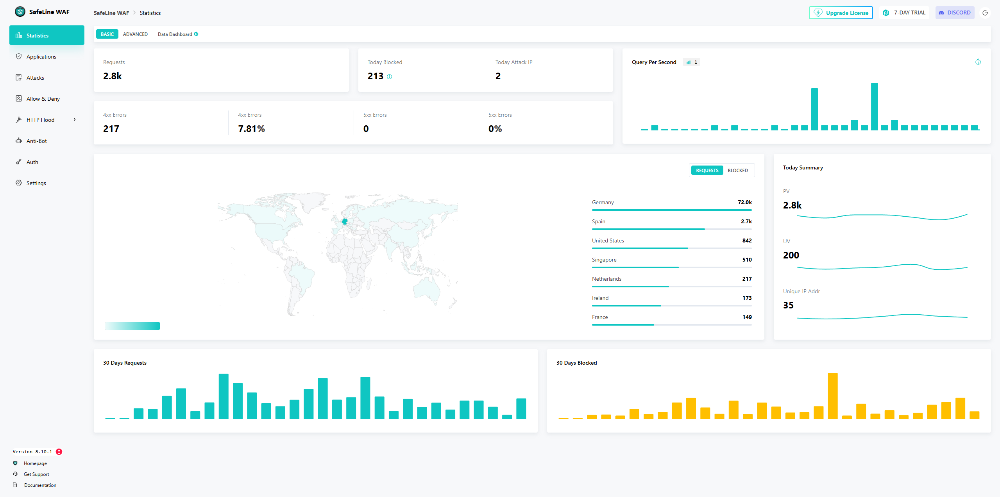
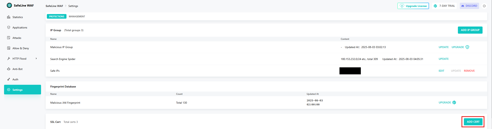
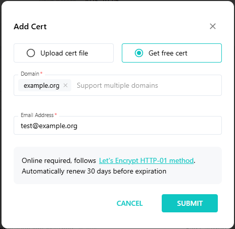
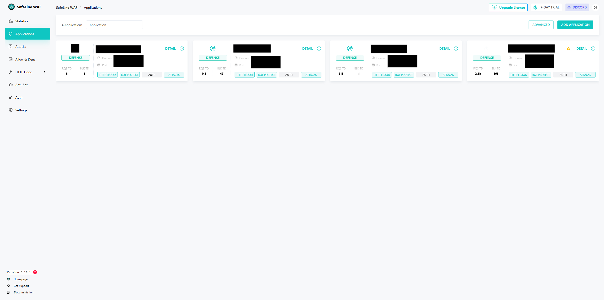
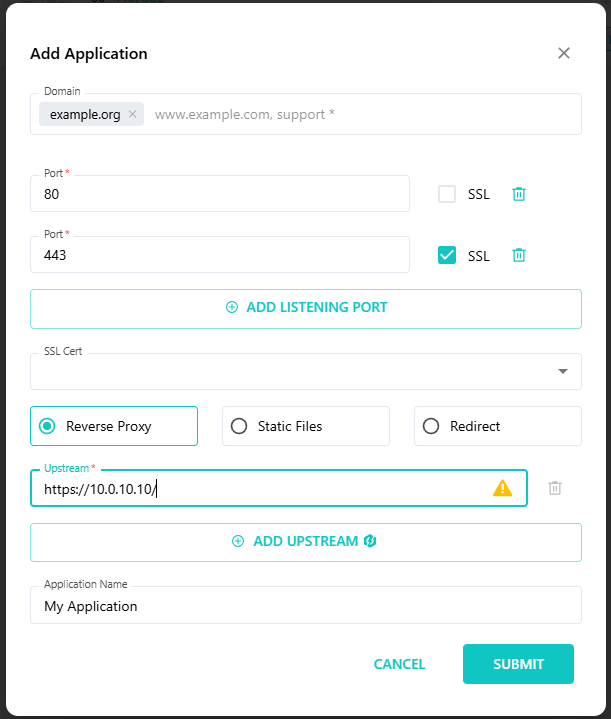
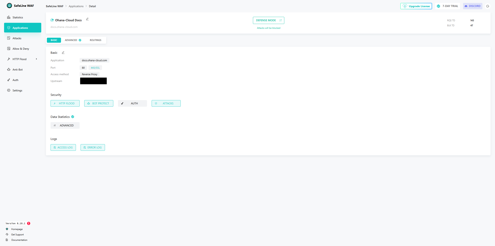
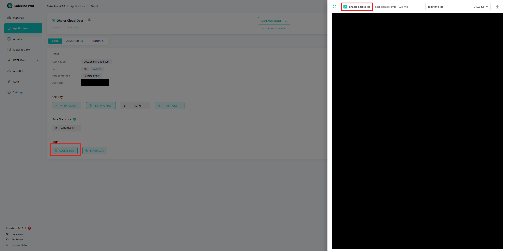

# Safeline - The Open Source WAF

> SafeLine is a self-hosted WAF to protect your web apps from attacks and exploits.
>
> A web application firewall helps protect web apps by filtering and monitoring HTTP traffic between a web application and the Internet. It typically protects web apps from attacks such as SQL injection, XSS, code injection, os command injection, CRLF injection, ldap injection, xpath injection, RCE, XXE, SSRF, path traversal, backdoor, brute-force, http-flood, bot abused, among others.

<p align="right"><a herf="https://github.com/chaitin/SafeLine/">github.com/chaitin/SafeLine</a></p>


## Setup

The installation of [SafeLine](https://github.com/chaitin/SafeLine) is rather easy, since the developers provide a simple docker setup. There are a few dependencies and requirements you need to check and verify before you can begin.

### Requirements and Dependencies

The base requirements are:

|Requirement|Value|
|:----------|:----|
|Operating System|Linux (most are fine)|
|Instruction architecture|x86_64, arm64|
|CPU|1 core CPU|
|RAM|1 GB|
|Storage|5 GB|

The software dependencies are also quickly listed:

|Dependency|Version|
|:---------|:----|
|Docker|Version 20.10.14 or above|
|Docker Compose|Version 2.0.0 or above

If you are unsure if you have the right docker version, you can use the following commands

```console
docker version
docker compose version
```

The output of these commands should be similar to the following example:

```console
[root@safeline ~]$ docker version
Version:           28.3.1
 API version:       1.51
 Go version:        go1.24.4
 Git commit:        38b7060
 Built:             Wed Jul  2 20:57:52 2025
 OS/Arch:           linux/amd64
 Context:           default

Server: Docker Engine - Community
 Engine:
  Version:          28.3.1
  API version:      1.51 (minimum version 1.24)
  Go version:       go1.24.4
  Git commit:       5beb93d
  Built:            Wed Jul  2 20:56:12 2025
  OS/Arch:          linux/amd64
  Experimental:     false
 containerd:
  Version:          1.7.27
  GitCommit:        05044ec0a9a75232cad458027ca83437aae3f4da
 runc:
  Version:          1.2.5
  GitCommit:        v1.2.5-0-g59923ef
 docker-init:
  Version:          0.19.0
  GitCommit:        de40ad0
[root@safeline ~]$ docker compose version
Docker Compose version v2.38.1
```

If you want to install docker on AlmaLinux you can follow [this Guide](../../servers/linux/almalinux_setup.md/#installing-docker).

### SafeLine Deployment

With all requirements fulfilled, the installation using Docker can be done using a script provided by the developers of SafeLine. 

```console
bash -c "$(curl -fsSLk https://waf.chaitin.com/release/latest/manager.sh)" -- --en
```

Once the deployment is completed, which is signaled by the command finishing, you can access the Web UI of SafeLine using `https://safeline-ip:9443/`. You can also replace the IP address with an already configured DNS name.

!!! tip "Reset Safeline password
    Usually, after deployment a new login will be generated and will be presented within the console. If this isn't the case, you can use the following command to reset the password.

    ```console
    docker exec safeline-mgt resetadmin
    ```

    You should see the following output, with the password readable:

    ```console
    [SafeLine] Initial username：admin
    [SafeLine] Initial password：**********
    [SafeLine] Done
    ```


Now you can log into the Web UI using your new credentials and you should be greeted by the **Statistics** page.




## Securing an Application

SafeLine defines the websites it protects as *Application*. 

### SSL Certificate setup

Before you can add an application to secure, you need to provide SafeLine with a valid SSL certificate. You can either

1. Provide SafeLine with an already generated and valid SSL certificate
2. Generate a new SSL certificate with SafeLine using LetsEncrypt

You can access the certificate management via the **Settings** menu on the left. Search the **SSL Cert** tab and click on the **Add Cert** button.



You will be presented the 2 options mentioned earlier. Either you upload the *Cert* and *Key* file from an SSL certificate you already have or you click on **Get free cert**. Here you can enter one or more domains you want to generate an SSL Certificate for. Provide an Email Address for your certificate and click on **Submit**.

!!! Warning
    Please make sure your SafeLine instance is reachable using these Domain(s) from the Internet.



Once your certificate is generated, you can use it to create applications.

### Adding an application

Moving forward to secure your application, you need to go the the **Applications** tab on the left.



Click on the **Add Application** button on the top right of this tab. Here you are asked to fill in the following information:

- **Domain**: Enter the domain(s) under which the website is hosted/reachable.
- **Port**: Add the ports your website is using. The standard HTTP and HTTP/S port should be filled in already.
- **SSL Cert**: Here you can add an SSL Cert. SSL Certs need to be added or generated by SafeLine. You can do this using the integrated SSL Certificate Management.
- **Forwarding**: Select how SafeLine forwards the traffic. It can act as one of the following:

    - **Reverse Proxy**: If chosen, SafeLine will use *nginx* to proxy the web traffic to the given web server. The configuration of nginx will be automatically created by SafeLine. You need to provide an **Upstream** target, which is usually the internal IP address or DNS name of your webserver.
    - **Static Files**: Instead of proxying the traffic to another webserver, SafeLine can target Static files directly using nginx. 
    - **Redirect**: SafeLine redirects the web traffic to another DNS name. You need to provide the redirect address here.

- **Application Name**: Enter the name of your Application. This doesn't affect functionality.



!!! note "SSL tick box"
    The SSL tick box indicates which of the configured ports is using SSL. You can, for example, add a custom port for an web application that doesn't use port 443 for HTTP/S easy this way. If you don't tick the SSL box you will get errors accessing the web application using this port.

Once you created your application, it will appear in the Applications menu. You can click on **Details** to see the configuration. This Details pane provides the Security and log settings. SafeLine provides 4 different security measures:

- **HTTP Flood**: HTTP Flooding is an DDoS attack. SafeLine handles this by limiting the rate of requests from a single source.
- **Bot Protect**: SafeLine uses this setting to identify whether the request is generated by a human or a bot, which could be a crawler, vulnerability scanner, worms and exploit tools. This feature pre-checks the legitimacy of the client environment when a users access your website. For more information refer to [SafeLine Anti-Bot](https://docs.waf.chaitin.com/en/tutorials/advanced/captcha-challenge)
- **Auth**: SafeLine offers the possibility to put websites behind an additional *Authentication Challenge*. This featurue requires addtional authentication methods like SafeLine-local users or connected SSO/Third-Party Logins.
- **Attacks**: This feature, when enabled, stops web-based attacks before they reach the webserver. It is based on[mod_security](https://modsecurity.org/) and can be configured to various intense degrees.



Enable and configure these settings for this Application to your liking. Depending on your license, some settings can only be set globally. You can access these configurations using the corresponding menus on the left.

To enable the **Access** and **Error** logs, click on on of the logs and click **Enable**.



!!! tip
    If you want to put your SafeLine instance behind itself, you can add it as an application and just set the *upstream* to **https://127.0.0.1:9443**. You can use this to block the access from the default port using normal firewalls and redirect the traffic from your custom port to the default port while also monitoring the access using SafeLine itself.

