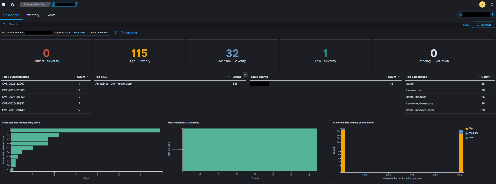
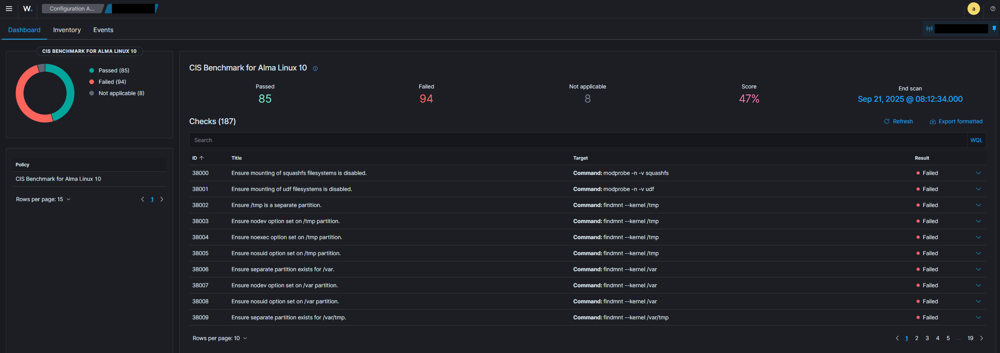
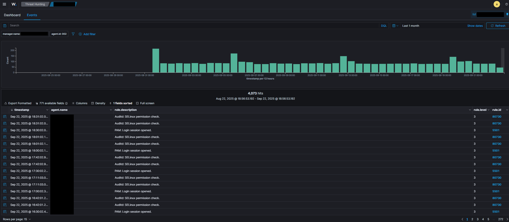
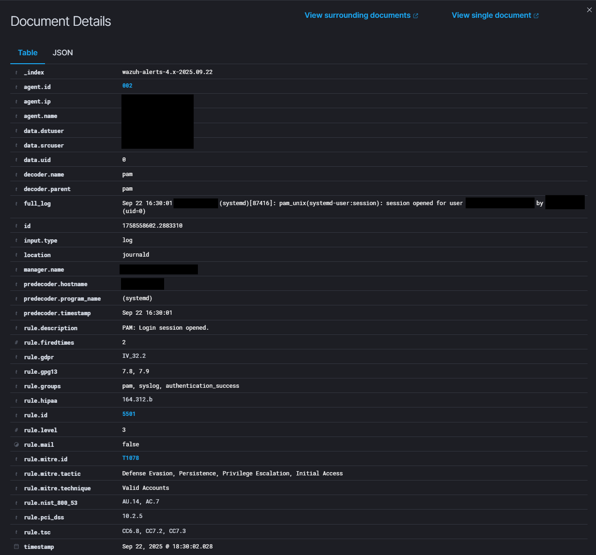
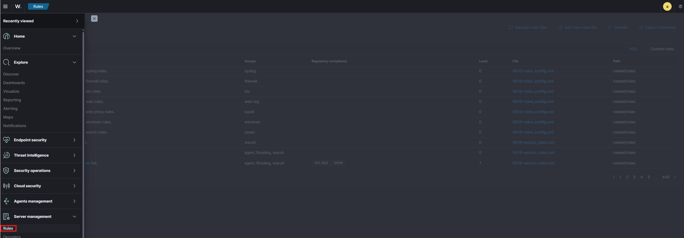
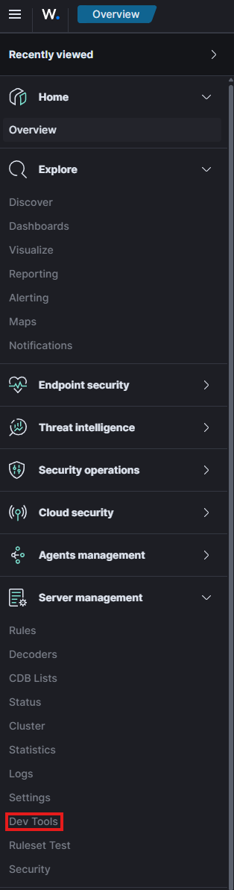
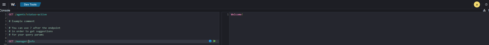
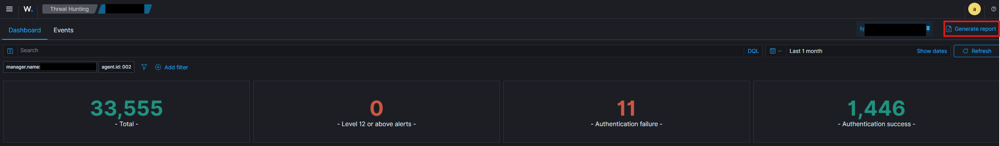

# Wazuh - EDR Software Solution

**Wazuh**, created in 2015, is an open-source, freely available and extensive EDR solution. It can be used in all scales of environments. Wazuh operators on a management and agent module. To put it simply, a device is dedicated to running Wazuh called the *manager*. The *agents* are installed on the devices that need to be monitored. 

If you want to install Wazuh and how to configure it have a look at this [Setup Guide](wazuh_setup.md).


## Vulnerability Assessment

Wazuh's vulnerability assessment module is a powerful tool that can be used to periodically scan an agent's operating system for installed applications and their corresponding versions.

Wazuh can use this information, retrieved by the agent, to compare it against a database of CVEs to discover potential vulnerabilities. The vulnerability scanner module will perform a full scan when the Wazuh agent is first [installed](wazuh_setup.md#wazuh-agents) on a device and **must** be configured to run at a set interval afterwards. 

!!! note
    By default it is set to 5 minute intervals using the following configuration

    ```xml
    <vulnerability-detector>
        <enabled>no</enabled>
        <interval>5m</interval>
        <ignore_time>6h</ignore_time>
        <run_on_start>yes</run_on_start>
    ```

When everything is configured correctly, each agent will provide an overview of the detected vulnerabilities.




## Compliance & Policy Auditing

Wazuh has the capabilities to audit and monitor an agent's configuration whilst proactively recording event logs. These audits are performed against a variety of frameworks an legislations such as [NIST](https://www.nist.gov/cyberframework), [MITRE](https://evals.mitre.org/) or [CIS](https://www.cisecurity.org/cis-benchmarks).



This Overview shows the percentage on how many checks have been passed by the system, which checks have not and navigating to the **Events** tab gives an insight on events related to settings that were audited.

!!! tip
    While Wazuhs compliance check is a good way to check your systems configuration and hardening level, it usually gives more insight to run the audit manually using tools like [OpenScap](../../servers/linux/hardening/openscap.md).


## Logon Monitoring

Wazuh's security event monitor can also actively record both successful and unsuccessful authentication attempts. You can find these logs by navigating to an agent and go into the **Threat Hunting** menu.



Clicking on one of these events using the icon on the left will provide more detail to the event.



The alert was created because a user logged onto a system. You can see that this is classified as **Rule 5501**, which indicates a successful login. For example, **Rule 5503** indicates a failed login. 

You can find and add rules by navigating to the **Rules** menu which is located under the left side tab called **Server Management**.




## Wazuh API

The Wazuh management server features a rich and extensive API to allow CLI-based interaction. This API requires authentication. To do this, a token needs to be generated and then used.

```bash
# Lets create the Token for the authentication
TOKEN=$(curl -u : -k -X GET "https://WAZUH_MANAGEMENT_SERVER_IP:55000/security/user/authenticate?raw=true")

# Lets use the token to access the API
curl -k -X GET "https://MACHINE_IP:55000/" -H "Authorization: Bearer $TOKEN"
```

The standard HTTP request methods like

- GET
- POST
- PUT
- DELETE

can be used by providing relevant parameters, for example ``-X GET``. 

!!! note
    
    This example uses ``curl``. Other tools can also be used to access the Wazuh API


??? example "Getting information about the Wazuh Manger"

    To list some statistics and important information about the Wazuh management server, including what services are being monitored and some general settings, the following command can be used:

    ```bash
    curl -k -X GET "https://MACHINE_IP:55000/manager/configuration?pretty=true§ion=global" -H "Authorization: Bearer $TOKEN"
    ```

??? example "Using the API to interact with an agent"

    This command can be used to interact with an Wazuh agent:

    ```bash
    curl -k -X GET "https://MACHINE_IP:55000/agents?pretty=true&offset=1&limit=2&select=status%2Cid%2Cmanager%2Cname%2Cnode_name%2Cversion&status=active" -H "Authorization: Bearer $TOKEN"
    ```

### Wazuh API Console

Wazuh also offers a powerful, integrated API console within the Wazuh website to query management servers and agents. This is not as extensive as using CLI-Tools where scripts and programs can be used to construct more complex queries, but more convenient.

The API console can be found by navigating to **Server management** and then clicking on the **Dev Tools** menu.



The API console defaults to a few sample queries that can be run. Simply select the line and press the green arrow that will appear to the right of the line.




## Generating Reports

Wazuh provides a reporting module that allows a summarized breakdown of events that have occurred on an agent. Navigating to the **Threat Hunting** menu of an agent exposed the **Generate report** option.(1)
{ .annoate }

1. Navigate to an agent and click on the **Threat Hunting** menu on the tab menu on the top.




Clicking on it will generate a PDF report that can be downloaded. All generated report can be found within the Report menu which can be found using the left navigation bar.