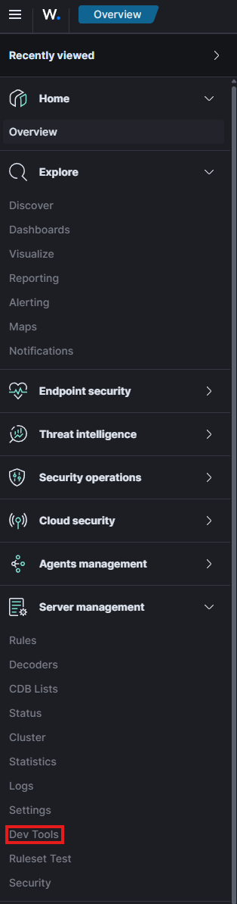

# Installing Wazuh on Almalinux 10 - Quickstart Guide

The **Wazuh** server consists of 3 components:

- Wazuh indexer
- Wazuh server
- Wazuh dashboard

These components can be installed on different and on the same machine alike. This guide focuses on the installation on the same machine. For more complex and demanding workloads it is recommended to provide separate servers for the components.

## Requirements

Wazuh itself recommends the following hardware capabilities depending on the amount of agents:

|Agents|CPU|RAM|Storage for 90 days|
|:-----|:--|:--|:------------------|
|1-25|4 vCPU|8 GiB|50 GB|
|25-50|8 vCPU|8 GiB|100 GB|
|50-100|8vCPU|8 GiB|200 GB|

!!! note
    For very small setups (homelab etc.) less RAM can be used.

## Installation Process

Wazuh offers an *Installation assistant* that completely deploys all requirements and installs the essentials components of Wazuh.


```console
[root@wazuh user]# curl -sO https://packages.wazuh.com/4.12/wazuh-install.sh && sudo bash ./wazuh-install.sh -a
```

Once the installation assistant finishes the installation, the console will display the web interface as well as the default user and password.

```console
INFO: --- Summary ---
INFO: You can access the web interface https://<WAZUH_DASHBOARD_IP_ADDRESS>
    User: admin
    Password: <ADMIN_PASSWORD>
INFO: Installation finished.
```

After successfully logging in Wazuh opens with the *Overview* tab.


## Wazuh Agents

Devices that record the events and processes of a system are called **agents**. They monitor the processes and events that take place on the device they are installed on, such as authentication and user management. Agents will offload these logs to designated collectors for processing like Wazuh.

In Order for Wazuh to be populated, agents need to be installed on devices that need to be monitored. 

Wazuh offers a configuration tool to deploy new agents which asks for some elemental information like:

- What OS is being used?
- The address of the Wazuh Server that the agent should send logs to (can be a DNS entry or IP address)
- What group the agent will be under (1)
{ .annotate }

1.  Agents can be sorted into groups within Wazuh for easier management and reporting.


To add new agents, the relevant menu can be found by going to the navigation menu in the upper left and clicking on the **Summary** link within the **Agents management** tab.


Within the **Summary** View of the Agents Management menu, there is an option to **Deploy new agents**. Clicking on it will open the agent configuration menu.


This menu guides through the OS selection as well as other key information required to install the agent correctly on the target system. Wazuh will even provide a simple installation command which installs and registers the agent with Wazuh.


## Wazuh API

The Wazuh management server features a rich and extensive API to allow CLI-based interaction. This API requires authentication. To do this, a token needs to be generated and then used.

```bash
# Lets create the Token for the authentication
TOKEN=$(curl -u : -k -X GET "https://WAZUH_MANAGEMENT_SERVER_IP:55000/security/user/authenticate?raw=true")

# Lets use the token to access the API
curl -k -X GET "https://MACHINE_IP:55000/" -H "Authorization: Bearer $TOKEN"
```

The standard HTTP request methods like

- GET
- POST
- PUT
- DELETE

can be used by providing relevant parameters, for example ``-X GET``. 

!!! note
    
    This example uses ``curl``. Other tools can also be used to access the Wazuh API


??? example "Getting information about the Wazuh Manger"

    To list some statistics and important information about the Wazuh management server, including what services are being monitored and some general settings, the following command can be used:

    ```bash
    curl -k -X GET "https://MACHINE_IP:55000/manager/configuration?pretty=true§ion=global" -H "Authorization: Bearer $TOKEN"
    ```

??? example "Using the API to interact with an agent"

    This command can be used to interact with an Wazuh agent:

    ```bash
    curl -k -X GET "https://MACHINE_IP:55000/agents?pretty=true&offset=1&limit=2&select=status%2Cid%2Cmanager%2Cname%2Cnode_name%2Cversion&status=active" -H "Authorization: Bearer $TOKEN"
    ```

### Wazuh API Console

Wazuh also offers a powerful, integrated API console within the Wazuh website to query management servers and agents. This is not as extensive as using CLI-Tools where scripts and programs can be used to construct more complex queries, but more convenient.

The API console can be found by navigating to **Server management** and then clicking on the **Dev Tools** menu.



The API console defaults to a few sample queries that can be run. Simply select the line and press the green arrow that will appear to the right of the line.

