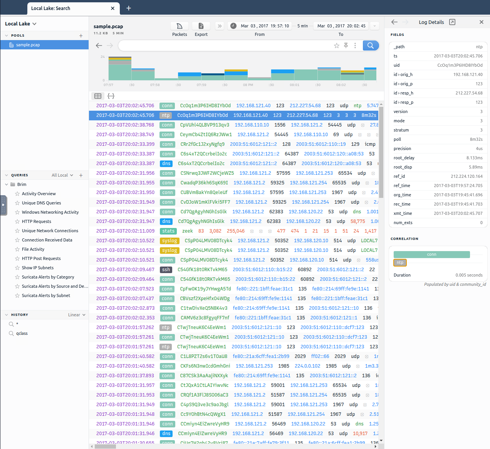
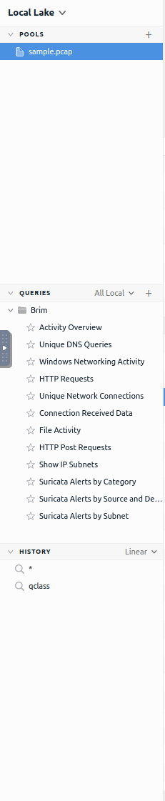
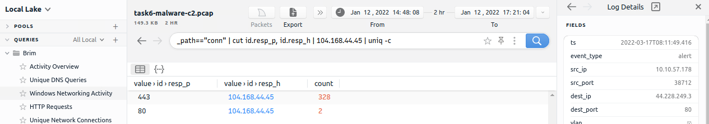

# BRIM
[BRIM](https://www.brimdata.io/) is an open source desktop app that processes pcap files and logs files. Its primary focus is providing search and analytics.

It can handle two types of data as an input:

- **Packet Capture Files**: pcap files created with tcpdump, TShark, and Wireshark-like applications.
- **Log Files**: structured log files like Zeek logs.

Brim is built on different open source platforms:

- [**Zeek**](zeek.md): log generating engine.
- **Zed Language**: log querying language that allows performing keyword searches with filters and pipelines.
- **ZNG Data Format**: data storage format that supports saving data streams.
- **Electron and React**: cross-platform UI.

## The basics
Once you open the app, the landing page loads up. The landing page has three sections and a file importing window. It also provides quick info on supported file formats.

- **Pools**: data resources, investigated pcap, and log files.
- **Queries**: list of available queries.
- **History**: list of launched queries

### Pools and log details
**Pools** represent important files. When you start loading a pcap file, Brim creates Zeek logs, correlates them and displays the findings in a timeline.
These timelines provide information when the capture started and ended as well as information fields.

### Queries and history
Queries help you to correlate finding and find the event of interest. History stores executed queries as well.

 

You can also see the 12 pre-made queries the Brim offers.

Using those queries, you can go through specific zeek log files directly and filter them:

 