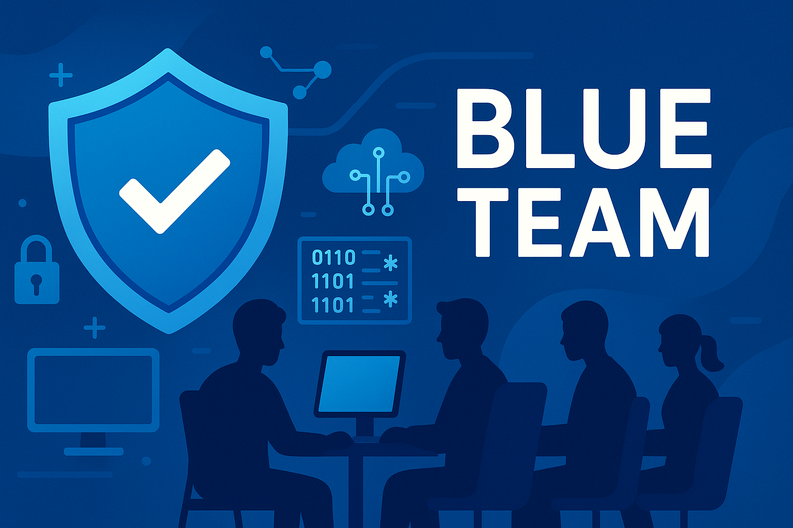

# Blue Teaming

**Blue Teaming** refers to the defensive side of cybersecurity operations. Blue Teams are responsible for protecting an organization's networks, systems, and data from cyber threats. Their tasks include monitoring for suspicious activity, implementing security measures, conducting incident response, and ensuring compliance with security policies. The goal of Blue Teaming is to detect, respond to, and prevent cyberattacks.

