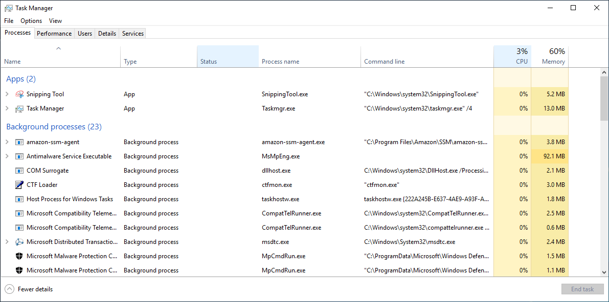
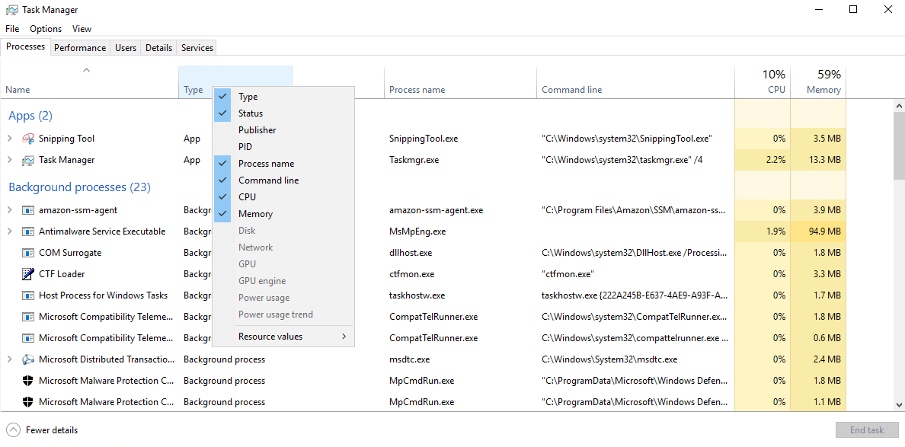
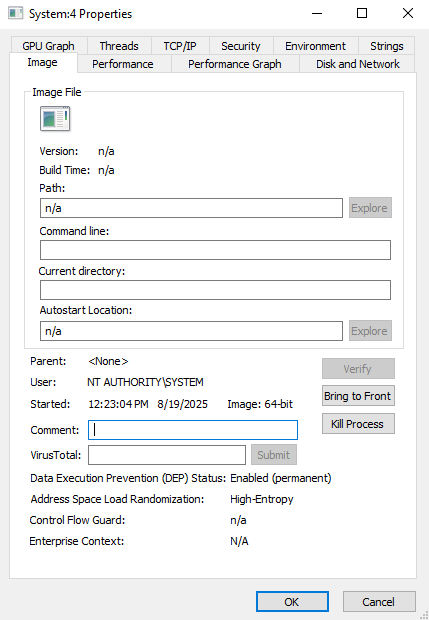
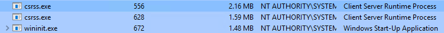
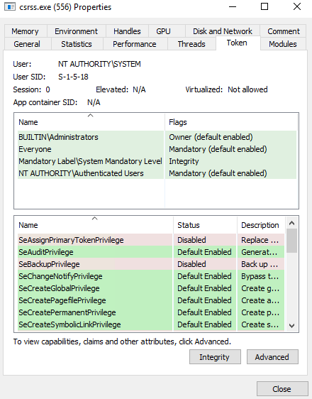
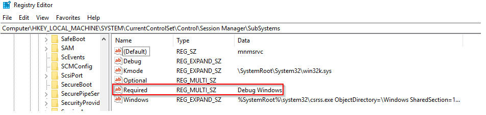
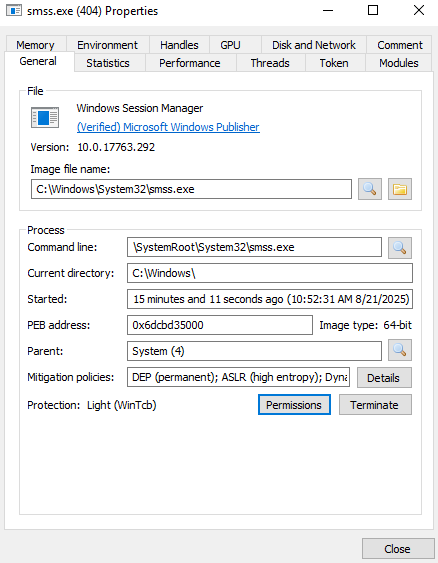
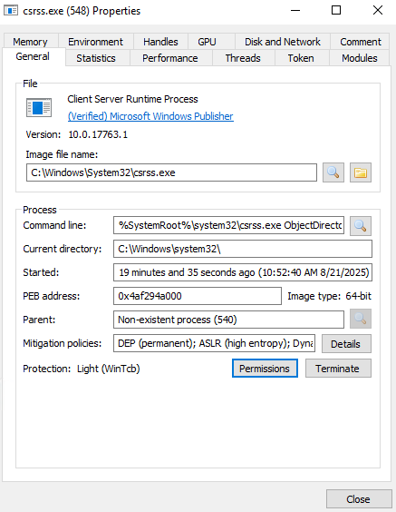
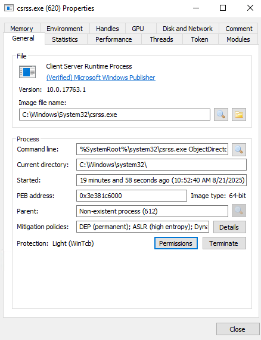
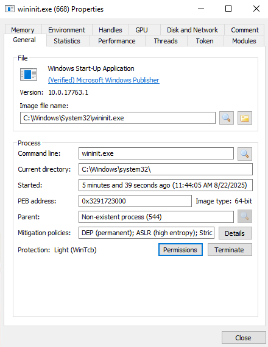

# Core Windows Processes

Since Windows, as mentioned [here](../index.md) is the most used desktop OS in the world, it is also one of the biggest targets for malware and attacks. Even the newest tools are not 100% effective, so a deeper understanding of normal Windows OS behavior and how you can detect malicious processes running on an endpoint is important.

## Task Manager

The **Task Manager** is a built-in GUI-based Windows utility that enables users to see what is currently running on a given Windows system. It also provides information on resource usage like the CPU and memory utilization by each process. It can also be used to terminate processes.

You can open the Task Manager by right-clicking the Taskbar and selecting *Task Manager*.

??? tip "Adding more columns"
    The standard columns are usually **Name**,**Status**,**CPU** and **Memory**. You can add and view more columns by right-clicking on any column header to open more options.

    

    The columns you can add are:

    - **Type**: Each process is either an *App*, an *Background process* or an *Windows process*
    - **Publisher**: The author of the program/file
    - **PID**: Windows assigns a unique PID each time a program starts. If the same program has multiple running processes, each will have its unique PID
    - **Process name**: The file name of the process
    - **Command line**: The full command used to launch the process
    - **CPU**: The amount of CPU utilization by the process
    - **Memory**: The amount of physical working memory utilized by the process

    The **Details** tab provides a more detailed view by default.

Since the Task Manager doesn't provide a *parent-child* process view, other tools like the [**System Informer**](https://systeminformer.sourceforge.io/) and [**Process Explorer**](https://learn.microsoft.com/en-us/sysinternals/downloads/process-explorer) can be used.(1)
{ .annotate }

1. The tool *System Informer* was known under the name **Process Hacker**.

## Windows Process - System

The **System** process, which always gets the PID 4, is a special kind of thread that runs only in *kernel-mode*. System threads have all attributes and contexts of regular *user-mode* threads[^1] but are different in that they run only in kernel-mode executing code loaded in system space like loading device drivers. In addition, system threads don't have a user process address space and hence must allocate any dynamic storage from OS memory heaps, such as a paged or nonpaged pool. If you want to know more about *kernel mode* and *user mode* follow [this](https://learn.microsoft.com/en-us/windows-hardware/drivers/gettingstarted/user-mode-and-kernel-mode) link.

[^1]: Such as a hardware context, priority and more

=== "Process Explorer"

    Using the **Process Explorer** tool, you can view these properties and we can identify the normal behavior of this process.

    

    The important information for this process is:

    - **Image Path**: N/A
    - **Parent Process**: None
    - **Number of Instances**: One
    - **User Account**: Local System
    - **Start Time**: At boot time

=== "System Informer"

    If you use the **System Informer** tool, the information looks a bit different.

    

    The important information that you can see here, which is different from the one provided by the Process Explorer, is:

    - **Image Path**: ``C:\Windows\system32\ntoskrnl.exe``
    - **Parent Process**: System Idle Process (0)

Using this information, unusual behavior for this process would be:

- Having a parent process aside from the *System Idle Process (0)*
- Multiple instances of System, because it should only be one
- A different PID instead of 4
- Not running in Session 0

## Windows Process - Session Manager Subsystem

The process **smss.exe** (Session Manager Subsystem) is also known as the **Windows Session Manager** and responsible for creating new sessions. It is the first user-mode process started by the kernel. It then starts the kernel and user modes of the Windows subsystem.[^2]

[^2]: You can read more about the NT Architecture [here](https://en.wikipedia.org/wiki/Architecture_of_Windows_NT). This subsystem includes:

- **win32k.sys** (kernel mode)
- **winsrv.dll** (user mode)
- **csrss.exe** (user mode)

The *smss.exe* starts the *csrss.exe** (Windows Subsystem) and the *wininit.exe* in Session 0, an isolated Windows session for the OS. Csrss.exe and winlogon.exe start in Session 1, which is the user session. The first child instance creates a child instance in new sessions, done by smss.exe copying itself into the new session and self-terminating. You can find more detailed information about this process [here](https://en.wikipedia.org/wiki/Session_Manager_Subsystem).

As you can see in this Screenshot, there are multiple csrss.exe processes running. Below you can see that they have different Session IDs

=== "Session 0"

    

=== "Session 1"

    

Any other subsystem listed in the **Required** value of the Registry Key ``HKLM\System\CurrentControlSet\Control\Session Manager\Subsystems`` is also launched.

SMSS is also responsible for creating *environment variables*, virtual memory paging files and starts the winlogon.exe (Windows Logon Manger). 

The normal behavior of this process is:

- **Image Path**: ``%SystemRoot%\System32\smss.exe``
- **Parent Process**: System
- **Number of instances**: One master instance and child instance per session. Child instances exit after creating the session.
- **User Account**: Local System
- **Start Time**: Within seconds of boot time for the master instance

Based on this, unusual behavior would be:

- A different parent process other than System (4)
- The image path is different
- More than one running process, since the child processes terminate and exit after each new session
- The running User is not the *System* user
- Unexpected registry entries for Subsystem

## Windows Process - Client Server Runtime Process

The **csrss.exe** (Client Server Runtime Process) is the user-mode side of the Windows subsystem. It is always running and critical to system operation. This process is responsible for the Win32 console windows and process thread creation and deletion. For each instance, these DLLs are loaded:

- csrsv.dll
- basesrv.dll
- winsrv.dll

!!! warning
    The termination of this process will result in system failure.

!!! note
    csrss.exe and winlogon.exe are called from the [smss.exe](#windows-process---session-manager-subsystem) at startup for Session 1

The normal behavior for Session 0 and Session 1 should look like below

=== "Session 0"

    

=== "Session 1"

    

You can see the different parent process and that they are **non-existent** since the *smss.exe* terminates itself.

The normal behavior of this process is:

- **Image Path**: ``%SystemRoot%\System32\csrss.exe``
- **Parent Process**: Created by an instance of smss.exe
- **Number of instances**: Two or more
- **User Account**: Local System
- **Start Time**: Within seconds of boot time for the first 2 instances (Session 0 and 1). Start times for additional instances occur as new sessions are created, but usually only Session 0 and 1 exist.

Bases on this, unusual behavior would be:

- An actual parent process since smss.exe, which calls this process, terminates itself
- A different Image File path
- Subtle misspellings to hide rogue processes masquerading as csrss.exe
- The user is not the *System* user

## Windows Process - Windows Initialization Process

The **wininit.exe** (Windows Initialization Process) is responsible for launching the

- **services.exe**: Service Control Manger
- **lsass.exe**: Local Security Authority
- **lsaiso.exe**

It is also classified as a critical Windows process that runs in the background, along with its child processes. It is always created within Session 0.

!!! note
    lsaiso.exe is a process associated with **Credential Guard and KeyGuard**. This process only appears if Credential Guard is enabled.

The normal behavior of the process is as follows:

- **Image Path**: ``%SystemRoot%\System32\wininit.exe``
- **Parent Process**: Created by an instance of smss.exe
- **Number of instances**: One
- **User Account**: Local System
- **Start Time**: Within seconds of boot time

Based on this, unusual behavior would be:

- An actual parent process, since smss.exe calls this process and self-terminates
- A different Image file path
- Subtle misspellings to hide rogue processes in plain sight
- Multiple running instances
- Not running as System