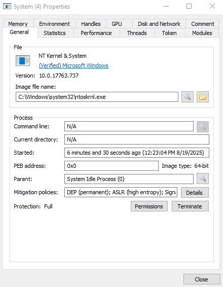
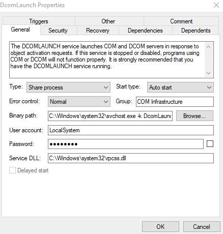
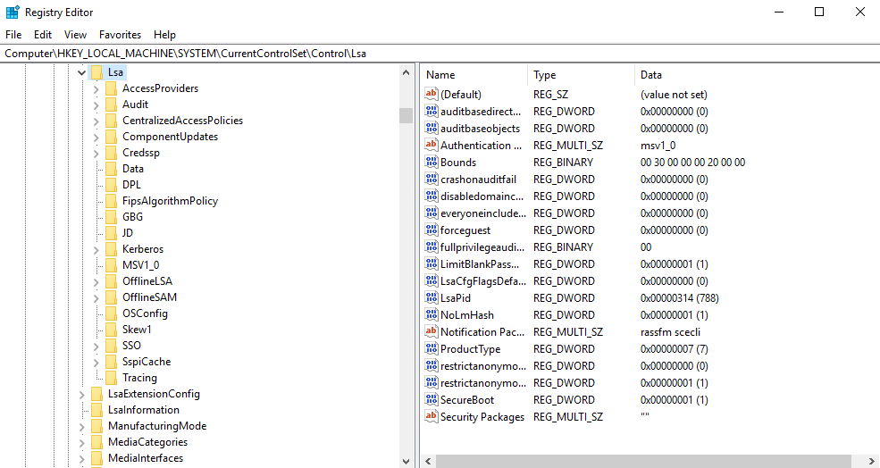

# Core Windows Processes

Since Windows, as mentioned [here](../index.md) is the most used desktop OS in the world, it is also one of the biggest targets for malware and attacks. Even the newest tools are not 100% effective, so a deeper understanding of normal Windows OS behavior and how you can detect malicious processes running on an endpoint is important.

## Task Manager

The **Task Manager** is a built-in GUI-based Windows utility that enables users to see what is currently running on a given Windows system. It also provides information on resource usage like the CPU and memory utilization by each process. It can also be used to terminate processes.

You can open the Task Manager by right-clicking the Taskbar and selecting *Task Manager*.


??? tip "Adding more columns"
    The standard columns are usually **Name**,**Status**,**CPU** and **Memory**. You can add and view more columns by right-clicking on any column header to open more options.

    

    The columns you can add are:

    - **Type**: Each process is either an *App*, an *Background process* or an *Windows process*
    - **Publisher**: The author of the program/file
    - **PID**: Windows assigns a unique PID each time a program starts. If the same program has multiple running processes, each will have its unique PID
    - **Process name**: The file name of the process
    - **Command line**: The full command used to launch the process
    - **CPU**: The amount of CPU utilization by the process
    - **Memory**: The amount of physical working memory utilized by the process

    The **Details** tab provides a more detailed view by default.


Since the Task Manager doesn't provide a *parent-child* process view, other tools like the [**System Informer**](https://systeminformer.sourceforge.io/) and [**Process Explorer**](https://learn.microsoft.com/en-us/sysinternals/downloads/process-explorer) can be used.(1)
{ .annotate }

1. The tool *System Informer* was known under the name **Process Hacker**.

## Windows Processes

### System

The **System** process, which always gets the PID 4, is a special kind of thread that runs only in *kernel-mode*. System threads have all attributes and contexts of regular *user-mode* threads[^1] but are different in that they run only in kernel-mode executing code loaded in system space like loading device drivers. In addition, system threads don't have a user process address space and hence must allocate any dynamic storage from OS memory heaps, such as a paged or nonpaged pool. If you want to know more about *kernel mode* and *user mode* follow [this](https://learn.microsoft.com/en-us/windows-hardware/drivers/gettingstarted/user-mode-and-kernel-mode) link.

[^1]: Such as a hardware context, priority and more


=== "Process Explorer"


    Using the **Process Explorer** tool, you can view these properties and we can identify the normal behavior of this process.

    


    The important information for this process is:

    - **Image Path**: N/A
    - **Parent Process**: None
    - **Number of Instances**: One
    - **User Account**: Local System
    - **Start Time**: At boot time


=== "System Informer"

    If you use the **System Informer** tool, the information looks a bit different.

    

    The important information that you can see here, which is different from the one provided by the Process Explorer, is:

    - **Image Path**: ``C:\Windows\system32\ntoskrnl.exe``
    - **Parent Process**: System Idle Process (0)

Using this information, unusual behavior for this process would be:

- Having a parent process aside from the *System Idle Process (0)*
- Multiple instances of System, because it should only be one
- A different PID instead of 4
- Not running in Session 0

### Session Manager Subsystem

The process **smss.exe** (Session Manager Subsystem) is also known as the **Windows Session Manager** and responsible for creating new sessions. It is the first user-mode process started by the kernel. It then starts the kernel and user modes of the Windows subsystem.[^2]

[^2]: You can read more about the NT Architecture [here](https://en.wikipedia.org/wiki/Architecture_of_Windows_NT). This subsystem includes:

- **win32k.sys** (kernel mode)
- **winsrv.dll** (user mode)
- **csrss.exe** (user mode)

The *smss.exe* starts the *csrss.exe** (Windows Subsystem) and the *wininit.exe* in Session 0, an isolated Windows session for the OS. Csrss.exe and winlogon.exe start in Session 1, which is the user session. The first child instance creates a child instance in new sessions, done by smss.exe copying itself into the new session and self-terminating. You can find more detailed information about this process [here](https://en.wikipedia.org/wiki/Session_Manager_Subsystem).


As you can see in this Screenshot, there are multiple csrss.exe processes running. Below you can see that they have different Session IDs


=== "Session 0"

    


=== "Session 1"

    


Any other subsystem listed in the **Required** value of the Registry Key ``HKLM\System\CurrentControlSet\Control\Session Manager\Subsystems`` is also launched.


SMSS is also responsible for creating *environment variables*, virtual memory paging files and starts the winlogon.exe (Windows Logon Manger). 

|Service Property|Normal Behavior|Unusual Behavior|
|:---------------|:--------------|:---------------|
|**Image Path**|``%SystemRoot%\System32\smss.exe``|A different image file path|
|**Parent Process**|System|A different parent process other than System (4)s|
|**Number of Instances**|One master instance and child instance per session. Child instances exit after creating the session|More than one running process, since the child processes terminate and exit after each new session|
|**User Account**|Local System|Not running as *SYSTEM*|
|**Start Time**|Within seconds of boot time for the master instance||


!!! note
    Unexpected registry entries for the subsystem are also counted towards unusual behavior.


### Client Server Runtime Process

The **csrss.exe** (Client Server Runtime Process) is the user-mode side of the Windows subsystem. It is always running and critical to system operation. This process is responsible for the Win32 console windows and process thread creation and deletion. For each instance, these DLLs are loaded:

- csrsv.dll
- basesrv.dll
- winsrv.dll

!!! warning
    The termination of this process will result in system failure.

!!! note
    csrss.exe and winlogon.exe are called from the [smss.exe](#windows-process-session-manager-subsystem) at startup for Session 1

The normal behavior for Session 0 and Session 1 should look like below

=== "Session 0"

    


=== "Session 1"

    


You can see the different parent process and that they are **non-existent** since the *smss.exe* terminates itself.


|Service Property|Normal Behavior|Unusual Behavior|
|:---------------|:--------------|:---------------|
|**Image Path**|``%SystemRoot%\System32\csrss.exe``|A different image file path|
|**Parent Process**|Created by an instance of smss.exe|An actual parent process, since smss.exe calls this process and self-terminates|
|**Number of Instances**|Two or more||
|**User Account**|Local System|Not running as *SYSTEM*|
|**Start Time**|Within seconds of boot time for the first 2 instances (Session 0 and 1). Start times for additional instances occur as new sessions are created, but usually only Session 0 and 1 exist.||


### Windows Initialization Process

The **wininit.exe** (Windows Initialization Process) is responsible for launching the

- **services.exe**: Service Control Manger
- **lsass.exe**: Local Security Authority
- **lsaiso.exe**

It is also classified as a critical Windows process that runs in the background, along with its child processes. It is always created within Session 0.

!!! note
    lsaiso.exe is a process associated with **Credential Guard and KeyGuard**. This process only appears if Credential Guard is enabled.

|Service Property|Normal Behavior|Unusual Behavior|
|:---------------|:--------------|:---------------|
|**Image Path**|``%SystemRoot%\System32\wininit.exe``|A different image file path|
|**Parent Process**|Created by an instance of smss.exe|An actual parent process, since smss.exe calls this process and self-terminates|
|**Number of Instances**|One|Multiple running instances|
|**User Account**|Local System|Not running as *SYSTEM*|
|**Start Time**|Within seconds of boot time||


### Service Control Manager (SCM)

The **SCM** or **services.exe** is primarily responsible to handle system services. This includes:

- loading services
- interacting with services
- starting and stopping services

It maintains a database that can be queried using the built-in Windows utility **sc.exe**.

```powershell
PS C:\Users\Administrator> sc.exe
DESCRIPTION:
        SC is a command line program used for communicating with the
        Service Control Manager and services.
USAGE:
        sc <server> [command] [service name] <option1> <option2>...
```

Information regarding the services is stored within the registry under the path ``HKLM\System\CurrentControlSet\Services``


This process also leads device drivers marked as *auto-start* into memory.

When a user logs into a machine successfully, it also is responsible for setting the value of the Last Known Good control set (Last Known Good Configuration) to that of the *CurrenControlSet*. Tha value of the Last Known Good control set can be found in the registry key ``HKLM\System\Select\`` within the value **LastKnownGood**.


The process is a parent to several other key processes like:

- svchost.exe
- spoolsv.exe
- msmpeng.exe
- dllhost.exe

You can find more detailed information about this process [here](https://en.wikipedia.org/wiki/Service_Control_Manager).


|Service Property|Normal Behavior|Unusual Behavior|
|:---------------|:--------------|:---------------|
|**Image Path**|``%SystemRoot%\System32\services.exe``|A different image file path|
|**Parent Process**|wininit.exe|Another parent process than wininit.exe|
|**Number of Instances**|One|Multiple running instances|
|**User Account**|Local System|Not running as *SYSTEM*|
|**Start Time**|Within seconds of boot time||


### Service Host

The **Service Host** or **svchost.exe** is the Host Process for Windows Services. It is responsible for hosting and managing Windows services.


The services running in this process are implemented as DLLs. The DLL to implement is stored in the registry under the **Parameters** subkey in **ServiceDLL**. The path to this key is ``HKLM\SYSTEM\CurrentControlSet\Services\SERVICE NAME\``. See the example below for the ServiceDDL value of the *Dcomlaunch* service


You can also view this information within the Process Hacker tool by right-clicking the svchost.exe process.


Within the details of the service you can again find the referenced DLL.



You can also see within the **Binary path** that the svchost.exe is called with the ``-k`` parameter. This parameters is used for grouping similar services to share the same process. This concept was based on the OS design and implemented to reduce resource consumption. Starting with **Windows 10 1703**, services grouped into host processes changed. Machines that have more then 3.5 GB of RAM will use a separate process for each service. You can look [here](https://en.wikipedia.org/wiki/Svchost.exe) for more information. The ``-k`` parameter is the way on how to legitimately call the svchost.exe process.

Since svchost.exe will always have multiple running processes on any given Windows system, this process is a prime target for malicious use. It can be used to masquerade malware and hide it among the legitimate svchost.exe process. Renaming the malware to svchost.exe or misspelling it slightly are common tactics, as well as installing or calling malicious DLLs.

|Service Property|Normal Behavior|Unusual Behavior|
|:---------------|:--------------|:---------------|
|**Image Path**|``%SystemRoot%\System32\svchost.exe``|A different image file path|
|**Parent Process**|services.exe|Another parent process than services.exe|
|**Number of Instances**|Many||
|**User Account**|This varies depending on the svchost.exe instance. In Windows 10/11, some instances run as logged-in users. ||
|**Start Time**|Typically within seconds of boot time. Other instances of svchost.exe can be started after boot.||

With this service, it is important to check the spelling of the process (svchost.exe instead of scvhost.exe) and the existence of the ``-k`` parameter.


### Local Security Authority Subsystem Service

The process **LSASS** in Microsoft Windows OS is responsible for enforcing security policies on the system. It performs the following functions:

- Verifies user logins onto the system
- Handles password changes
- Creates access token
- Writes logging to the *Windows Security Log*

It creates security tokens for

- **SAM** (Security Account Manager)
- **AD** (Active Directory)
- **NETLOGON**

It uses authentication packages specified in ``HKLM\System\CurrentControlSet\Control\Lsa``.



LSASS.exe is another prominent targt for malicious activity. Common tools like **mimikatz** are used to dump credentials, or attackers mimic this process to hide in plain sight by renaming their malware or misspelling it slightly.

|Service Property|Normal Behavior|Unusual Behavior|
|:---------------|:--------------|:---------------|
|**Image Path**|``%SystemRoot%\System32\lsass.exe``|A different image file path|
|**Parent Process**|wininit.exe|Another parent process than wininit.exe|
|**Number of Instances**|One|Multiple running instances|
|**User Account**|Local System|Not running as *SYSTEM*|
|**Start Time**|Within seconds of boot time||


### Windows Logon

The **winlogon.exe** process is responsible for handling the **Secure Attention Sequence** (SAS). It is the ++ctrl+als+del++ key combinations users press to enter their username and password. It is also responsible for loading the user profile by loading the user's **NTUSER.DAT** into ``HKCU``. The **userinit.exe** loads the user's shell. You can out more about this process [here](https://learn.microsoft.com/en-us/previous-versions/windows/it-pro/windows-2000-server/cc939862(v=technet.10)?redirectedfrom=MSDN).


??? tip "Checking the shell key"
    The shell value within this registry key should always be **explorer.exe**. Other values indicate abnormal behavior.


The service also locks the screen and runs a users screensaver, among other functions. 

!!! note
    As mentioned in the [csrss.exe section](#client-server-runtime-process), **smss.exe** launches this process along with a copy of **csrss.exe** within Session 1

|Service Property|Normal Behavior|Unusual Behavior|
|:---------------|:--------------|:---------------|
|**Image Path**|``%SystemRoot%\System32\winlogon.exe``|A different image file path|
|**Parent Process**|Created by an instance of smss.exe that self-terminates, so no parent process name is provided|An actual parent process, since smss.exe self-terminates.|
|**Number of Instances**|One or more||
|**User Account**|Local System|Not running as *SYSTEM*|
|**Start Time**|Within seconds of boot time for the first instance (Session 1). Additional instances occur as new sessions are created, typically through RDP or Fast User Switching logons||


### Windows Explorer

The **explorer.exe** process gives the user access to their folders and files. It also provides functionality for other features, such as the *Start Menu* and *Taskbar*.

As mentioned [before](#windows-logon), the Winlogon.exe runs *userinit.exe**, which launches the value in the registry key ``HKLM\Software\Microsoft\Windows NT\CurrentVersion\Winlogon\Shell``. The userinit.exe terminates after spawning **explorer.exe**. Therefore, the Windows Explorer's parent process is non-existent.

The explorer.exe will usually have many child processes.


|Service Property|Normal Behavior|Unusual Behavior|
|:---------------|:--------------|:---------------|
|**Image Path**|``%SystemRoot%\explorer.exe``|A different image file path|
|**Parent Process**|Created by userinit.exe, which self-terminates|An actual parent process, since userinit.exe calls the process and exists|
|**Number of Instances**|One or more per interactively logged-in user||
|**User Account**|Logged-in users|Not running as unknown user|
|**Start Time**|First instance when the first interactive user logon session begins||

!!! tip
    Outbound TCP/IP connections indicate abnormal behavior as well.

