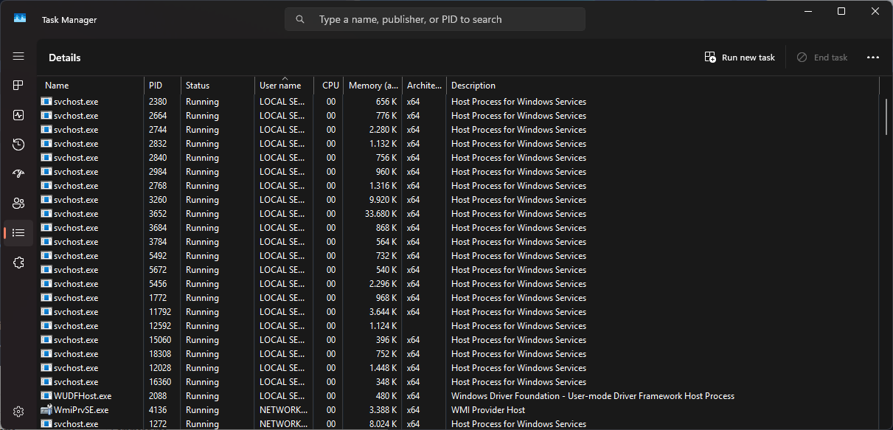

# Windows OS fundamentals

## Core Windows Processes

You can use the **Task Manager**, a built-in Windows tool, to understand the underlying processes inside a Windows machine. The Task Manager is a GUI-based Windows utility which provides an overview on what is running on the Windows system. It additionally provides information on resource usage, such as how much each process utilizes CPU and memory. You can also terminate processes using the Task Manager.

The following processes are Core Windows processes and them running is considered to be normal behavior:

- **System**
- **System**
  
  -  -> **smss.exe**

- **crss.exe**
- **wininit.exe**

  - -> **services.exe**

    - -> **svhost.exe**

- **lsass.exe**
- **winlogon.exe**
- **explorer.exe**

!!! note
    The **->** symbol represents a parent-child relationship: **smss.exe** is a child process of **System**

Except the **System** process, no process that isn't depicted with a parent process should have one. The **System** process can only have the **System Idle Process (0)** as its parent.

## Sysinternals

The **Sysinternals** tools are a compilation of over 70 Windows-based tools. Each of these tools falls into one of these categories:

- File and Disk utilities
- Networking utilities
- Process utilities
- Security utilities
- System Information
- Miscellaneous

Two very useful tools for endpoint investigation are:

- **TCPVIEW** -> Networking Utility tool
- **Process Explorer** -> Process Utility tool

### TCPVIEW

This tool is a Windows program that provides a detailed listings of all TCP and UDP endpoints on a Windows system, including the local and remote addresses and state of TCP connections. TCPView offers a more informative and conveniently presented subset of the **Netstat** program which is bundled with Windows. The TCPView download also includes **Tcpvcon**, a CLI version with the same functionality.

### Process Explorer

This tool consists of 2 sub-windows which are displayed. The top windows always shows a list of the currently active processes, including the names of their owning accounts, whereas the information displayed in the bottom windows depends on the mode that the **Process Explorer** is in. 

- **Handle Mode**: This mode provides a view into the handles that a selected process in the top windows has opened
- **DLL Mode**: This mode allows you to see the DLLs and memory-mapped files that the process has loaded

The Process Explorer enables you to inspect the details of a running process like:

- Associated services
- Invoked network traffic
- Handles such as files or directories opened
- DLLs and memory-mapped files loaded

