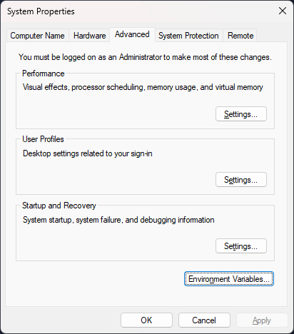
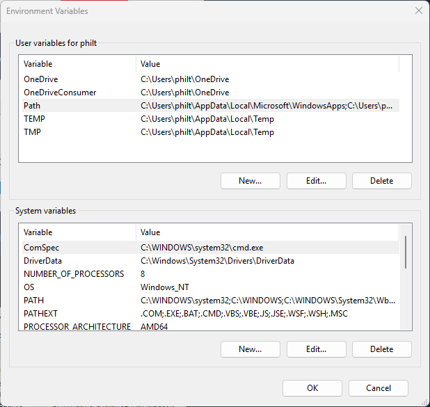
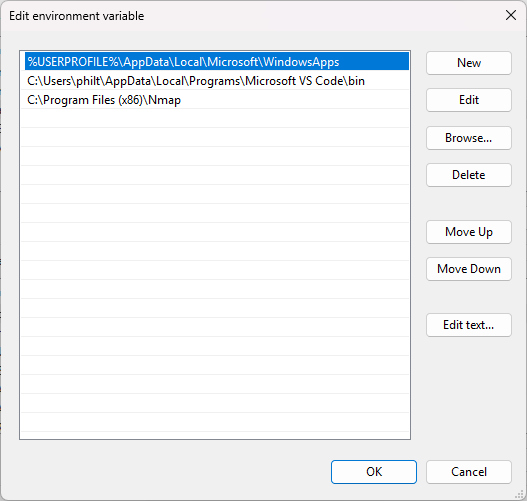

# Sysinternals

The **Sysinternals** tool is a compilation of over 70+ Windows-based tools. These encompass

- **File and Disk utilities**
- **Networking utilities**
- **Process utilities**
- **Security utilities**
- **System Information**
- **Miscellaneous**

The tool is very commonly used for managing Windows systems. It is in fact so popular that even Red Teams and adversaries use them.


## Installation

**Sysinternals** is not a built-in Windows tool, but is provided by Microsoft itself. You can find the entire Sysinternals suite or its single parts [here](https://learn.microsoft.com/en-us/sysinternals/downloads/). YOu can also find out more about the tools used provided by Sysinternals there.

Following the Download of the Sysinternals [ZIP File](https://download.sysinternals.com/files/SysinternalsSuite.zip), you need to extract these files. After the files are extracted, you can also add the folder path to the environment variables of Windows. This allows you to launch these tools from the CMD without navigating to the directory of these tools.

??? tip "Editing Environment variables"
    You can edit environment variables from the **System Properties** Menu. 

    1. You can launch this menu via the CMD by running ``sysdm.cpl``. 
    2. Go to the **Advanced** Tab and click on **Environment Variables...**.
    3. Select **Path** under **System Variables** and select *Edit*. Then press **OK**.
    4. In the new screen, select **New** and enter the folder path where the Sysinternals Suite was extracted to and confirm with OK.

    

    

    

    Now you should be able to run the Sysinternals tools from anywhere using the CMD.

You can also use **Sysinternals** executables directory from the Web without downloading it beforehand. Simply enter a tool's Sysinternals Live path into Windows Explorer or a CMD session as ``\\live.sysinternals.com\tools\<toolname>``. 

!!! note
    To access this web path from your system, you usually need to install and start the WebDAV client on the machine. On most modern Windows machines the client will already be installed, but you need to run it manually. You can start the service from a powershell admin session.

    ```pwsh-session
    PS C:\WINDOWS\system32> Get-Service webclient

    Status   Name               DisplayName
    ------   ----               -----------
    Stopped  WebClient          webclient

    PS C:\WINDOWS\system32> Start-Service webclient
    PS C:\WINDOWS\system32> Get-Service webclient

    Status   Name               DisplayName
    ------   ----               -----------
    Running  WebClient          webclient
    ```

    You also need to enable **Network Discovery**. You can find more about this topic [here](https://support.microsoft.com/en-us/windows/file-sharing-over-a-network-in-windows-b58704b2-f53a-4b82-7bc1-80f9994725bf).


## File and Disk Utilities

### Sigcheck

[**Sigcheck**](https://learn.microsoft.com/en-us/sysinternals/downloads/sigcheck) is a CLI tool that shows file version umber, timestamp information and digital signature details, including certificate chains. It also includes an option to check a file's status on [VirusTotal](https://www.virustotal.com/). You can use Sigcheck to, for example, look for unsigned files within ``C:\Windows\System32`` using these parameters:

- ``-u``: If VirusTotal is enabled, it shows the files that are unknown by VirusTotal or have non-zero detections. Otherwise it shows only unsigned files.
- ``-e``: Scan executable images only, regardless of their extension
  

```batch
C:\Users\Administrator\Desktop\SysinternalsSuite>sigcheck -u -e C:\Windows\System32 -accepteula

Sigcheck v2.90 - File version and signature viewer
Copyright (C) 2004-2022 Mark Russinovich
Sysinternals - www.sysinternals.com

No matching files were found.
```

!!! note
    Any files found would warrant an investigation into the listed executables.

### Streams

The NTFS file system provides applications the ability to create alternate data streams of information. By default, all data is stored in a file's main unnamed data stream, but by using the syntax *file:stream*, alternates can be written and read.

**Alternate Data Streams** (ADS) is a file attribute specific to Windows NTFS. Every file has at least on data stream ($Data) and ADS allows files to contain more than one stream of data. Natively the Windows Explorer doesn't display ADS to the user. Using the [**Streams**](https://learn.microsoft.com/en-us/sysinternals/downloads/streams) utility, you can view these information. 

```batch
C:\Users\Administrator\Desktop>SysinternalsSuite\streams.exe file.txt

streams v1.60 - Reveal NTFS alternate streams.
Copyright (C) 2005-2016 Mark Russinovich
Sysinternals - www.sysinternals.com

C:\Users\Administrator\Desktop\file.txt:
         :ads.txt:$DATA 26

C:\Users\Administrator\Desktop>notepad ./file.txt:ads.txt
```


### SDelete

[**SDelete**](https://learn.microsoft.com/en-us/sysinternals/downloads/sdelete) (Secure Delete) is a utility that can delete one or more files and/or directories or cleanse the free space on a logical disk.[^1]

[^1]: SDelete also implements the **DOD 5220.22-M** (Department of Defense clearing and sanitizing protocol). This is an algorithm that describes how to safely wipe data.

SDelete has been used by attackers and is associated with MITRE techniques [T1485 Data Destruction](https://attack.mitre.org/techniques/T1485/) and [T1070.004 Indicator Removal on Host: File Deletion](https://attack.mitre.org/techniques/T1070/004/). It's MITRE ID is [S0195](https://attack.mitre.org/software/S0195/).

