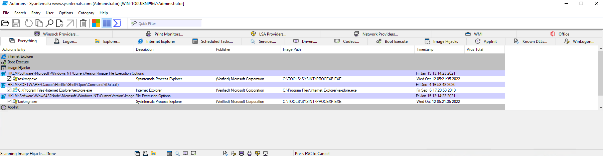
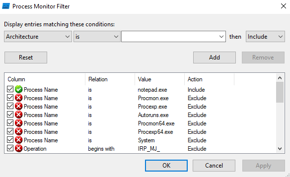
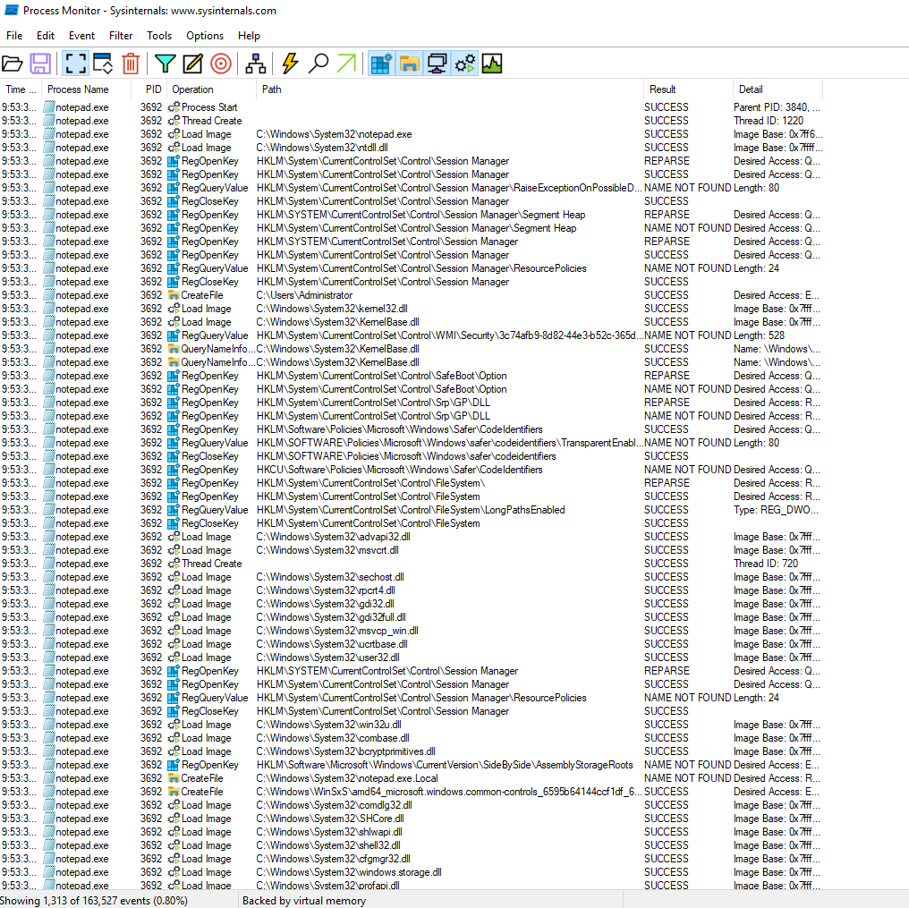
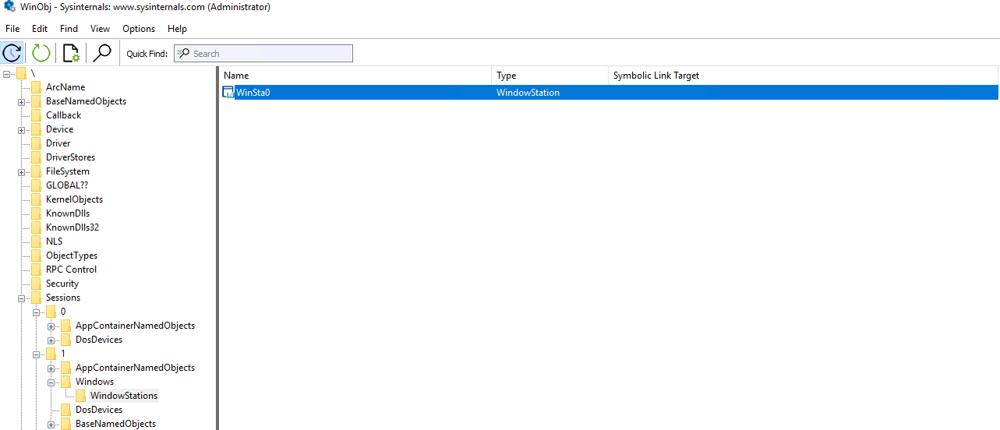
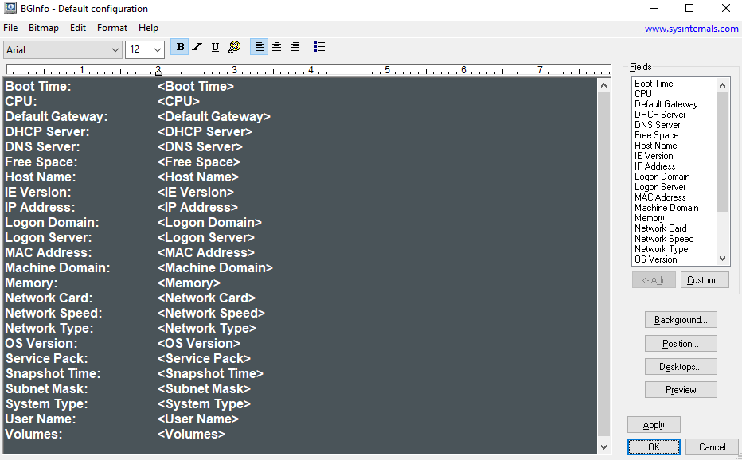
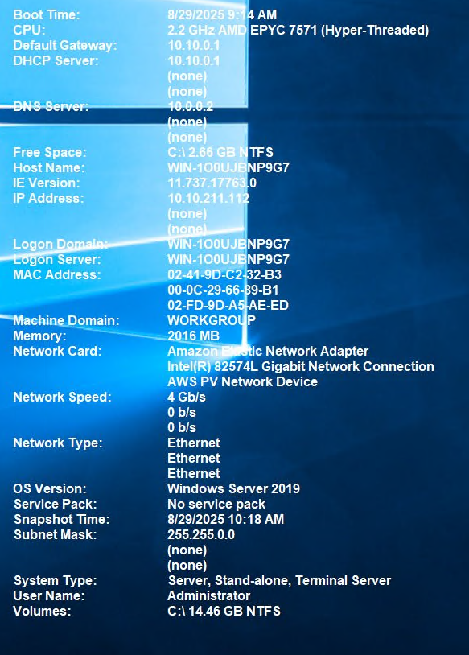

# Sysinternals

The **Sysinternals** tool is a compilation of over 70+ Windows-based tools. These encompass

- **File and Disk utilities**
- **Networking utilities**
- **Process utilities**
- **Security utilities**
- **System Information**
- **Miscellaneous**

The tool is very commonly used for managing Windows systems. It is in fact so popular that even Red Teams and adversaries use them.


## Installation

**Sysinternals** is not a built-in Windows tool, but is provided by Microsoft itself. You can find the entire Sysinternals suite or its single parts [here](https://learn.microsoft.com/en-us/sysinternals/downloads/). YOu can also find out more about the tools used provided by Sysinternals there.

Following the Download of the Sysinternals [ZIP File](https://download.sysinternals.com/files/SysinternalsSuite.zip), you need to extract these files. After the files are extracted, you can also add the folder path to the environment variables of Windows. This allows you to launch these tools from the CMD without navigating to the directory of these tools.

??? tip "Editing Environment variables"
    You can edit environment variables from the **System Properties** Menu. 

    1. You can launch this menu via the CMD by running ``sysdm.cpl``. 
    2. Go to the **Advanced** Tab and click on **Environment Variables...**.
    3. Select **Path** under **System Variables** and select *Edit*. Then press **OK**.
    4. In the new screen, select **New** and enter the folder path where the Sysinternals Suite was extracted to and confirm with OK.

    

    

    

    Now you should be able to run the Sysinternals tools from anywhere using the CMD.

You can also use **Sysinternals** executables directory from the Web without downloading it beforehand. Simply enter a tool's Sysinternals Live path into Windows Explorer or a CMD session as ``\\live.sysinternals.com\tools\<toolname>``. 

!!! note
    To access this web path from your system, you usually need to install and start the WebDAV client on the machine. On most modern Windows machines the client will already be installed, but you need to run it manually. You can start the service from a powershell admin session.

    ```pwsh-session
    PS C:\WINDOWS\system32> Get-Service webclient

    Status   Name               DisplayName
    ------   ----               -----------
    Stopped  WebClient          webclient

    PS C:\WINDOWS\system32> Start-Service webclient
    PS C:\WINDOWS\system32> Get-Service webclient

    Status   Name               DisplayName
    ------   ----               -----------
    Running  WebClient          webclient
    ```

    You also need to enable **Network Discovery**. You can find more about this topic [here](https://support.microsoft.com/en-us/windows/file-sharing-over-a-network-in-windows-b58704b2-f53a-4b82-7bc1-80f9994725bf).


## File and Disk Utilities

### Sigcheck

[**Sigcheck**](https://learn.microsoft.com/en-us/sysinternals/downloads/sigcheck) is a CLI tool that shows file version umber, timestamp information and digital signature details, including certificate chains. It also includes an option to check a file's status on [VirusTotal](https://www.virustotal.com/). You can use Sigcheck to, for example, look for unsigned files within ``C:\Windows\System32`` using these parameters:

- ``-u``: If VirusTotal is enabled, it shows the files that are unknown by VirusTotal or have non-zero detections. Otherwise it shows only unsigned files.
- ``-e``: Scan executable images only, regardless of their extension
  

```batch
C:\Users\Administrator\Desktop\SysinternalsSuite>sigcheck -u -e C:\Windows\System32 -accepteula

Sigcheck v2.90 - File version and signature viewer
Copyright (C) 2004-2022 Mark Russinovich
Sysinternals - www.sysinternals.com

No matching files were found.
```

!!! note
    Any files found would warrant an investigation into the listed executables.

### Streams

The NTFS file system provides applications the ability to create alternate data streams of information. By default, all data is stored in a file's main unnamed data stream, but by using the syntax *file:stream*, alternates can be written and read.

**Alternate Data Streams** (ADS) is a file attribute specific to Windows NTFS. Every file has at least on data stream ($Data) and ADS allows files to contain more than one stream of data. Natively the Windows Explorer doesn't display ADS to the user. Using the [**Streams**](https://learn.microsoft.com/en-us/sysinternals/downloads/streams) utility, you can view these information. 

```batch
C:\Users\Administrator\Desktop>SysinternalsSuite\streams.exe file.txt

streams v1.60 - Reveal NTFS alternate streams.
Copyright (C) 2005-2016 Mark Russinovich
Sysinternals - www.sysinternals.com

C:\Users\Administrator\Desktop\file.txt:
         :ads.txt:$DATA 26

C:\Users\Administrator\Desktop>notepad ./file.txt:ads.txt
```


### SDelete

[**SDelete**](https://learn.microsoft.com/en-us/sysinternals/downloads/sdelete) (Secure Delete) is a utility that can delete one or more files and/or directories or cleanse the free space on a logical disk.[^1]

[^1]: SDelete also implements the **DOD 5220.22-M** (Department of Defense clearing and sanitizing protocol). This is an algorithm that describes how to safely wipe data.

SDelete has been used by attackers and is associated with MITRE techniques [T1485 Data Destruction](https://attack.mitre.org/techniques/T1485/) and [T1070.004 Indicator Removal on Host: File Deletion](https://attack.mitre.org/techniques/T1070/004/). It's MITRE ID is [S0195](https://attack.mitre.org/software/S0195/).


## Process Utilities

### Autoruns

**Autoruns** is a utility which has the most comprehensive knowledge of auto-starting locations of any startup monitor. It shows you what programs are configured to run during system boot or login nad when you start various built-in Windows applications like Windows Explorer and media players. These programs and drivers include the ones in the startup folder, *Run*, *RunOnce* and other registry keys. **Autoruns** reports:

- Shell Extensions
- Toolbars
- Browser Help Objects
- Winlogon notifications
- Auto-Start services and more

!!! tip
    You can use this powerful tool to search for malicious entries created on the local machine to establish **Persistence**.

The **Everything** tab is the default tab when the tool is first launched.



You can see all tabs within the application.

### ProcDump

[**ProcDump**](https://learn.microsoft.com/en-us/sysinternals/downloads/procdump) is a CLI utility whose primary purpose is monitoring an application for CPU spikes and generating dumps during a spike that can be used to determine the cause of the spike.

```batch
C:\Users\Administrator\Desktop\SysinternalsSuite>procdump.exe

ProcDump v10.11 - Sysinternals process dump utility
Copyright (C) 2009-2021 Mark Russinovich and Andrew Richards
Sysinternals - www.sysinternals.com

Monitors a process and writes a dump file when the process exceeds the
specified criteria or has an exception.
```

!!! tip
    You can also use the previously mentioned **Process Explorer** tool.


### Process Monitor

**Process Monitor** is an advanced monitoring tool for Windows that shoes real-time activity within

- File System
- Registry
- Process/Thread activity

It provides features like:

- rich and non-destructive filtering
- comprehensive event properties such as session IDs and user names
- reliable process information
- full thread stacks with integrated symbol support for each operation
- simultaneous logging to a file

When you launch ProcMon, you must use the filter and must configure it properly.



Here the filter is set to **notepad.exe**




### PsExec

[**PsExec**](https://learn.microsoft.com/en-us/sysinternals/downloads/psexec) is a light-weight telnet-replacement that executes processes on other systems, complete with full interactivity for console applications, without having to manually install client software. One of its most powerful uses include launching interactive command-prompts on remote systems and remote-enabling tools like IpConfig that otherwise do not have the ability to show information about remote systems.

The PsExec utility is utilized by adversaries. It is associated with MITRE technique [T1570 Lateral Tool Transfer](https://attack.mitre.org/techniques/T1570/), [T1021.002 Remote Services: SMB/Windows Admin Shares](https://attack.mitre.org/techniques/T1021/002/) and [T1569.002 System Services: Service Execution](https://attack.mitre.org/techniques/T1569/002/). Its MITRE ID is [S0029](https://attack.mitre.org/software/S0029/).


## Security Utilities

### Sysmon

**Sysmon** (System Monitor) is a Windows system service and device driver that, once installed on a system, remains resident across system reboots to monitor and log system activity to the Windows event log. It provides detailed information about

- Process creation
- Network connections
- Changes to file creation time

By collection the events it generates using Windows Event Collection or SIEM agents and subsequently them, malicious or anomalous activity can be identified and helps to understand how intruders and malware operate on your network.


## System Information

### WinObj

**WinObj** is a 32-bit Windows NT program which uses the native NT API[^2] to access and display information on the NT Objects Manager's name space.

For example, you can use WinObj to identify Session 0 (OS Session) and Session 1 (User Session). 

[^2]: The NT API is provided by the NTDLL.DLL





!!! tip
    Use the tool on your own machine to see the differences more detailed.


## Miscellaneous

### BgInfo

**BgInfo** automatically displays relevant information about a Windows computer on the desktop's background, such as

- Computer name
- IP address
- Service pack version and more

This tool is commonly used by Windows Servers but can also see usage on clients.



Using this configuration, the displayed information is shown like in the picture below.



### RegJump

**RegJump** is a small CLI applet that takes a registry path and opens registry on that path. It accepts rook keys in standard (e.g. ``HKEY_LOCAL_MACHINE``) and abbreviated form (e.g. ``HKLM``).

```batch
C:\Users\Administrator\Desktop\SysinternalsSuite>regjump HKLM\System\CurrentControlSet\Services\WebClient

Regjump v1.1
Copyright (C) 2013-2015 Mark Russinovich
Sysinternals - www.sysinternals.com

Regedit jump to HKLM\SYSTEM\CURRENTCONTROLSET\SERVICES\WEBCLIENT complete.
```

### Strings

**Strings** just scans a file for UNICODE/ASCII strings of a default length of 3 or more UNICODE/ASCII characters.

```pwsh-session
PS C:\Users\Administrator\Desktop\SysinternalsSuite> strings .\ZoomIt.exe | findstr /i .pdb
C:\agent\_work\112\s\Win32\Release\ZoomIt.pdb
```