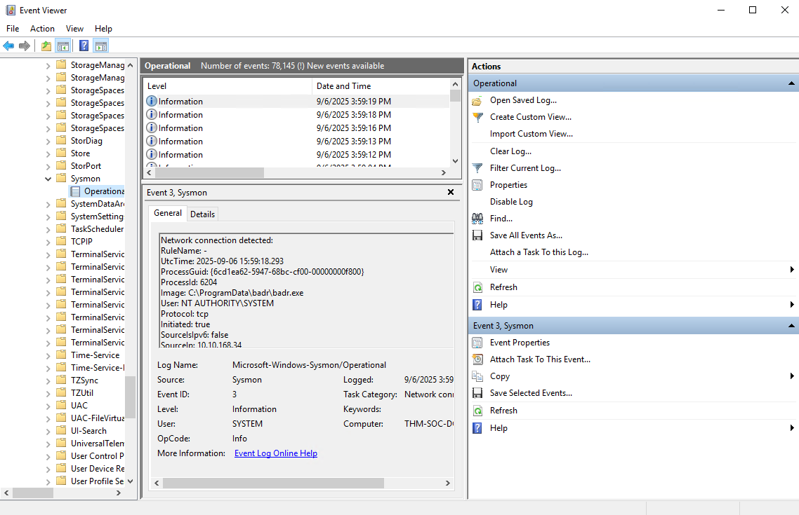

# Sysmon

**Sysmon** is a Windows system service and device driver that, if its installed, remains resident across system reboots to monitor and log system activity to the Windows event log. It provides detailed information about process creations,  network connections and changes to file creation time.

It basically gathers detailed and high-quality logs as well as event tracing that assists in identifying anomalies. This is a reason it is commonly used together with SIEM systems or other log parsing solutions.

Event within Sysmon are stored in ``Applications and Services Logs/Microsoft/Windows/Sysmon/Operation``.

## Sysmon Configuration Overview

Sysmon requires a config file in order to tell the binary how to analyze the events that it is receiving. Sysmon files can be created individually or already existing ones can be downloaded. One of these examples is a config file to identify anomalies which is created by [SwiftOnSecurity](https://github.com/SwiftOnSecurity/sysmon-config). Sysmon includes 29 different types of Event IDs, which can all be used within the configuration to specify how events should be handled an analyzed. 

When creating or modifying configuration files, it can be noticed that a majority of rules in *sysmon-config* will exclude events rather than include events. This helps to filter out normal activity in an environment and decrease the number of events and alerts that would need to be manually audited or searched through within a SIEM. There are also rulesets that take a more proactive approach by using a lot of includes.


### Event ID 1: Process Creation

This event will look for any processes that have been created. It can be used to look for known suspicious processes or processes with typos that would be considered an anomaly. It uses the **CommandLine** and **Image** XML tags.


??? example "Event ID  1 Example"

    ```xml
    <RuleGroup name="" groupRelation="or">
        <ProcessCreate onmatch="exclude">
            <CommandLine condition="is">C:\Windows\system32\svchost.exe -k appmodel -p -s camsvc</CommandLine>
        </ProcessCreate>
    </RuleGroup>
    ```

    This specifies the Event ID to pull from as well as what condition to look for. Here it is excluding **svchost.exe** from the event logs.

### Event ID 3: Network Connection

The network connection event will look for events that occur remotely. This includes files and sources of suspicious binaries as well as opened ports. It uses **Image** and **DestinationPort** tags.

??? example "Event ID 3 Example"

    ```xml
    <RuleGroup name="" groupRelation="or">
	    <NetworkConnect onmatch="include">
	 	    <Image condition="image">nmap.exe</Image>
	 	    <DestinationPort name="Alert,Metasploit" condition="is">4444</DestinationPort>
	    </NetworkConnect>
    </RuleGroup>
    ```

    This code will identify files transmitted over open ports, specifically looking for nmap.exe. It also will identify open ports, specifically port 4444. If the condition is met an event will be created.


### Event ID 7: Image Loaded

This event will look for DLLs loaded by processes, which is useful when hunting for DLL Injection and DLL Hijacking attacks. It is recommended to exercise caution when using this Event ID as it causes a high system load. It uses the **Image**, **Signed**, **ImageLoaded** and **Signature** XML tags.


??? example "Event ID 7 Example"

    ```xml
    <RuleGroup name="" groupRelation="or">
	    <ImageLoad onmatch="include">
	 	    <ImageLoaded condition="contains">\Temp\</ImageLoaded>
	    </ImageLoad>
    </RuleGroup>
    ```


### Event ID 8: CreateRemoteThread

The CreateRemoteThread Event ID monitors for processes injecting code into other processes. It is used for legitimate tasks and applications, however it can be used by malware to hide malicious activity. The event uses the **SourceImage**, **TargetImage**, **StartAddress** and **StartFunction** XML tags

??? example "Event ID 8 Example"

    ```xml
    <RuleGroup name="" groupRelation="or">
	    <CreateRemoteThread onmatch="include">
	 	    <StartAddress name="Alert,Cobalt Strike" condition="end with">0B80</StartAddress>
	 	    <SourceImage condition="contains">\</SourceImage>
	    </CreateRemoteThread>
    </RuleGroup> 
    ```

    This will monitor by

    1. Looking at the memory address for a specific ending condition which could be an indicator of a Cobalt Strike beacon
    2. Looking for injected processes that do not have a parent process, which can be considered an anomaly.


### Event ID 11: File Created

This event ID logs events when files are created or overwritten. It can be used to identify file names and signatures of files that are written to the disk and uses the **TargetFileName** XML tags.

??? example "Event ID 11 Example"

    ```xml
    <RuleGroup name="" groupRelation="or">
	    <FileCreate onmatch="include">
	 	    <TargetFilename name="Alert,Ransomware" condition="contains">HELP_TO_SAVE_FILES</TargetFilename>
	    </FileCreate>
    </RuleGroup>
    ```

    This is an example of an ransomware event monitor.


### Event ID 12/13/14: Registry Event

These events look for changes or modifications to the registry. Malicious activity from the registry can include persistence and credential abuse. It uses the **TargetObject** XML tags.


??? example "Event ID 12/13/14 Example"

    ```xml
    <RuleGroup name="" groupRelation="or">
	    <RegistryEvent onmatch="include">
	 	    <TargetObject name="T1484" condition="contains">Windows\System\Scripts</TargetObject>
	    </RegistryEvent>
    </RuleGroup>
    ```

    This will look for registry objects that are in the ``Windows\System\Scripts`` directory since this is a common directory to place scripts to establish persistence.

### Event ID 15: FileCreateStreamHash

The FileCreateStreamHash event looks for any files created in an alternate data stream. This is a common technique to hide malware. It uses the **TargetFilename** XML tags.


??? example "Event ID 15 Example"

    ```xml
    <RuleGroup name="" groupRelation="or">
	    <FileCreateStreamHash onmatch="include">
	 	    <TargetFilename condition="end with">.hta</TargetFilename>
	    </FileCreateStreamHash>
    </RuleGroup>
    ```

    This will look for files with the **.hta** extension that have been placed within alternate data streams.


### Event ID 22: DNS Event

This event logs all DNS queries. The most common way to deal with these events is to exclude all trusted domain that are very common within a given environment since it is easier to look for anomalies without the *noise*. It uses the **QueryName** XML tags.


??? example "Event ID 22 Example"

    ```xml
    <RuleGroup name="" groupRelation="or">
	    <DnsQuery onmatch="exclude">
	 	    <QueryName condition="end with">.microsoft.com</QueryName>
	    </DnsQuery>
    </RuleGroup>
    ```

    This will exclude any DNS events with the **.microsoft.com** query.


## Sysmon Installation

The installation for Sysmon is simple and only requires downloading the binary from Microsoft directly. If the [Sysinternals](sysinternals.md) tools are already downloaded/installed, Sysmon will already be there as well since it is included. The binary is also available via Powershell using the command ``Download-SysInternalsTools C:\Sysinternals``. 

To start Sysmon, a PowerShell session or Command prompt, running as the Administrator, is required. 

```pwsh-session
C:\Users\Administrator\Desktop\Tools\Sysmon>Sysmon.exe -accepteula -i ..\Configurations\swift.xml

System Monitor v12.03 - System activity monitor
Copyright (C) 2014-2020 Mark Russinovich and Thomas Garnier
Sysinternals - www.sysinternals.com

Loading configuration file with schema version 4.10
Sysmon schema version: 4.40
Configuration file validated.
Sysmon installed.
SysmonDrv installed.
Starting SysmonDrv.
SysmonDrv started.
Starting Sysmon..
```

After Sysmon is installed, events are stored within the Event Viewer under ``Applications and Services Logs/Microsoft/Windows/Sysmon/Operational``.

!!! note
    The configuration file can be changed anytime by uninstalling or updating the current configuration and replacing it with a new one. The Sysmon help menu offers more information.



## Reducing the noise

Most normal activity or *noise* seen on a network is excluded or filtered out with Sysmon. That leaves the meaningful events that need to be focused on. There are a few ways to optimize this filtration process. The following best practice tips can help reducing this *noise*.

|Best practice|Explanation|
|:------------|:----------|
|**Exclude > Include**| When creating rules for Sysmon configuration files it is best to prioritize excluding events rather than including them. This prevents accidentally missing crucial events and only seeing events that matter most.|
|**CLI gives further control**|Since it is common with most applications the CLI gives the most control and filtering capabilities allowing further granular control. The CLI can be used via either the ``Get-WinEvent`` cmdlet or the ``wevutil.exe`` binary to access and filter logs.|
|**Know the environment before implementation**|Knowing the environment to be monitored is important when implementing any platform or tool.


!!! note
    More information about Windows Event filtering can be found [here](windows_event_logs.md).

## Real Life Examples

### Metasploit

**Metasploit** is a commonly used exploit framework for penetration testing and red team operations. It can be used to easily run exploits on a machine and connect back to a **meterpreter** shell. By default, Metasploit is using port 4444, but port 5555 is also commonly used.

The Sysmon configuration to look for Metasploit looks as follows:


```xml
<RuleGroup name="" groupRelation="or">
	<NetworkConnect onmatch="include">
		<DestinationPort condition="is">4444</DestinationPort>
		<DestinationPort condition="is">5555</DestinationPort>
	</NetworkConnect>
</RuleGroup>
```

This uses the Event ID 3 along with the destination port to identify active connections on these ports. But you can also *hunt* for metasploit using the PowerShell cmdlet **Get-WinEvent**.

```pwsh-session
PS C:\Windows\system32> Get-WinEvent -Path C:\Users\Administrator\log.evtx -FilterXPath '*/System/EventID=3 and */EventData/Data[@Name="DestinationPort"] and */EventData/Data=4444'


   ProviderName: Microsoft-Windows-Sysmon

TimeCreated                     Id LevelDisplayName Message
-----------                     -- ---------------- -------
1/5/2021 2:21:32 AM              3 Information      Network connection detected:...
```


### Mimikatz

**Mimikatz** is a well known tool for dumping credentials from memory along with other Windows post-exploitation activity. It is mainly known for dumping [LSASS](./core_windows_processes.md#local-security-authority-subsystem-service).

Mimikatz can be identified in different ways. The first way is to just look for files created with the name **Mimikatz**. This is simple, but can still help when the Antivirus-Software has been bypassed.

```xml
<RuleGroup name="" groupRelation="or">
	<FileCreate onmatch="include">
		<TargetFileName condition="contains">mimikatz</TargetFileName>
	</FileCreate>
</RuleGroup>
```

Knowing how the **LSASS** process works and what its normal behavior is, a configuration for Sysmon can be created to target anomalies of the process. For example, since LSASS is always a child process of [svchost.exe](./core_windows_processes.md#service-host), it is a good way to look for LSASS processes that don't fit this.

```xml
<RuleGroup name="" groupRelation="or">
	<ProcessAccess onmatch="exclude">
		<SourceImage condition="image">svchost.exe</SourceImage>
	</ProcessAccess>
	<ProcessAccess onmatch="include">
		<TargetImage condition="image">lsass.exe</TargetImage>
	</ProcessAccess>
</RuleGroup>
```

Using PowerShell, this can be achieved using the following command:

```pwsh-session
PS C:\Windows\system32> Get-WinEvent -Path C:\Users\Administrator\log.evtx -FilterXPath '*/System/EventID=10 and */EventData/Data[@Name="TargetImage"] and */EventData/Data="C:\Windows\system32\lsass.exe"'


   ProviderName: Microsoft-Windows-Sysmon

TimeCreated                     Id LevelDisplayName Message
-----------                     -- ---------------- -------
1/5/2021 3:22:52 AM             10 Information      Process accessed:...
```

### Malware - RAT and backdoor

Malware itself has many forms and variations with different end goals. Two important types are RATs and backdoors. RATs are used similar to any other payload to gain access to a machine. They typically come with Anti-Virus or EDR evasion techniques that make them different than other payloads like *MSFVenom*. A RAT typically uses a Client-Server model and comes with an interface for easy user administration. Examples for RATs are **Xeexe** and **Quasar**. 

The first way to hunt for RATs and C2 Servers is similar to hunting [Metasploit](#metasploit). An example configuration for Sysmon can look like this:

```xml
<RuleGroup name="" groupRelation="or">
	<NetworkConnect onmatch="include">
		<DestinationPort condition="is">1034</DestinationPort>
		<DestinationPort condition="is">1604</DestinationPort>
	</NetworkConnect>
	<NetworkConnect onmatch="exclude">
		<Image condition="image">OneDrive.exe</Image>
	</NetworkConnect>
</RuleGroup>
```

Using PowerShell, this can be done with the following example:


```pwsh-session
PS C:\Windows\system32> Get-WinEvent -Path C:\Users\Administrator\log.evtx -FilterXPath '*/System/EventID=3 and */EventData/Data[@Name="DestinationPort"] and */EventData/Data=8000'


   ProviderName: Microsoft-Windows-Sysmon

TimeCreated                     Id LevelDisplayName Message
-----------                     -- ---------------- -------
1/5/2021 4:44:35 AM              3 Information      Network connection detected:...
1/5/2021 4:44:31 AM              3 Information      Network connection detected:...
1/5/2021 4:44:27 AM              3 Information      Network connection detected:...
1/5/2021 4:44:24 AM              3 Information      Network connection detected:...
1/5/2021 4:44:20 AM              3 Information      Network connection detected:...
1/5/2021 4:44:17 AM              3 Information      Network connection detected:...
```


### Looking for Persistence

**Persistence** is used by attackers to maintain access to a machine once it is compromised. There are a lot of different ways to gain persistence on a machine. For example, startup scripts are commonly used. Using Sysmon, the relevant startup directories can be observed for file creations that can indicate persistence.

```xml
<RuleGroup name="" groupRelation="or">
	<FileCreate onmatch="include">
		<TargetFilename name="T1023" condition="contains">\Start Menu</TargetFilename>
		<TargetFilename name="T1165" condition="contains">\Startup\</TargetFilename>
	</FileCreate>
</RuleGroup>
```

Modifications to the registry, where for example a script can be placed inside ``CurrentVersion\Windows\Run`` or other registry locations, can be detected as well.

```xml
<RuleGroup name="" groupRelation="or">
	<RegistryEvent onmatch="include">
		<TargetObject name="T1060,RunKey" condition="contains">CurrentVersion\Run</TargetObject>
		<TargetObject name="T1484" condition="contains">Group Policy\Scripts</TargetObject>
		<TargetObject name="T1060" condition="contains">CurrentVersion\Windows\Run</TargetObject>
	</RegistryEvent>
</RuleGroup>
```

### Detecting Evasion techniques

There are a number of evasion techniques used by malware authors to evade both Anti-Virus and detections like:

- Alternate Data Streams
- Injections
- Masquerading
- Packing/Compressing
- Recompiling
- Obfuscation
- Anti-Reversing Techniques

For example, to detect alternate data streams, [Event ID 15](#event-id-15-filecreatestreamhash) can be monitored. This Event ID will hash and log any NTFS Streams that are included within the Sysmon configuration file. That makes it possible to hunt for malware that evades detections using Alternate Data Streams. An example that hunts for files in the ``Temp`` and ``Download`` folder as well as looking for ``.hta`` and ``.bat`` extensions can look like the following example.

```xml
<RuleGroup name="" groupRelation="or">
    <FileCreateStreamHash onmatch="include">
        <TargetFilename condition="contains">Downloads</TargetFilename>
        <TargetFilename condition="contains">Temp\7z</TargetFilename>
        <TargetFilename condition="ends with">.hta</TargetFilename>
        <TargetFilename condition="ends with">.bat</TargetFilename>
    </FileCreateStreamHash>
</RuleGroup>
```

Adversaries also commonly use remote threads to evade detections in combination with other techniques. Remote threads are created using the Windows API **CreateRemoteThread** and can be accessed using **OpenThread** and **ResumeThread**. This is used for evasion techniques like:

- DLL Injection
- Thread Hijacking
- Process Hollowing

The Sysmon [Event ID 8](#event-id-8-createremotethread) can be used. A configuration that will exclude common remote threads withing including any specific attributes can look like the snippet below.

```xml
<RuleGroup name="" groupRelation="or">
    <CreateRemoteThread onmatch="exclude">
        <SourceImage condition="is">C:\Windows\system32\svchost.exe</SourceImage>
        <TargetImage condition="is">C:\Program Files (x86)\Google\Chrome\Application\chrome.exe</TargetImage>
    </CreateRemoteThread>
</RuleGroup>
```

Using PowerShell, this can look like the following example:

```pwsh-session
PS C:\Windows\system32> Get-WinEvent -Path C:\Users\Administrator\log.evtx -FilterXPath '*/System/EventID=8'


   ProviderName: Microsoft-Windows-Sysmon

TimeCreated                     Id LevelDisplayName Message
-----------                     -- ---------------- -------
7/3/2019 8:39:30 PM              8 Information      CreateRemoteThread detected:...
7/3/2019 8:39:30 PM              8 Information      CreateRemoteThread detected:...
7/3/2019 8:39:30 PM              8 Information      CreateRemoteThread detected:...
7/3/2019 8:39:30 PM              8 Information      CreateRemoteThread detected:...
7/3/2019 8:39:30 PM              8 Information      CreateRemoteThread detected:...
7/3/2019 8:39:30 PM              8 Information      CreateRemoteThread detected:...
7/3/2019 8:39:30 PM              8 Information      CreateRemoteThread detected:...
7/3/2019 8:39:30 PM              8 Information      CreateRemoteThread detected:...
7/3/2019 8:39:30 PM              8 Information      CreateRemoteThread detected:...
```