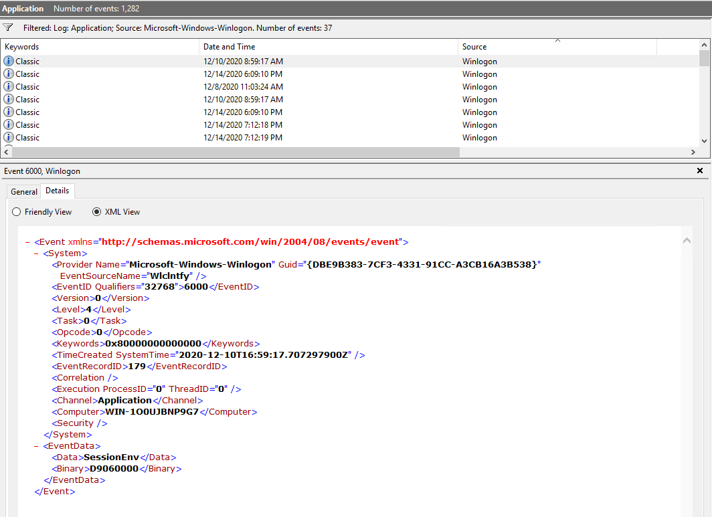

# Windows Event Logs

> Event logs record events taking place in the execution of a system that can be used to understand the activity of the system and to diagnose problems. They are essential to understand particularly in the case of applications with little user interaction.

<p align="right"><a herf="https://en.wikipedia.org/wiki/Logging_(computing)">Wikipedia.org</a></p>

This definition mostly applies to system administrators, technicians etc. In Cyber Security, Event Logs are used by blue teamers to analyze and correlate (unrelated) events on different servers. This is usually done by a SIEM.

Windows Event Logs are not presented as simple text files. They are stored in a proprietary binary format with an .evt or .evtx extension. To view them, built-in Windows tools can be used to translate them into XML. The log files usually can be found in ``C:\Windows\System32\winevt\Logs``.

There are 3 main ways of accessing event logs within a Windows system:

1. **Event Viewer**: GUI-based application
2. **Wevtutil.exe**: CLI Tool
3. **Get-WinEvent**: PowerShell cmdlet


## Windows Event Log Elements

Windows Event Logs are separated into different categories, each presenting logs to different activities on the system.

|Event Category|Description|
|:------------|:----------|
|**System Logs**|Records events associated with the OS. They may include information about hardware changes, device drivers, system changes and other activities related to the device that runs Windows|
|**Security Logs**|Records events connected to logon and logoff activities on a device. The system's audit policy specifies the events. The logs are an excellent source to investigate attempted or successful unauthorized activity.|
|**Application Logs**|Records events related to applications installed on a system. The majority of information revolves around application errors, events and warnings.|
|**Directory Service Events**|Active Directory changes and activities are recorded under this category. This can be found mostly on domain controllers.|
|**File Replication Service Events**|Records events associated with Windows Servers during the sharing of Group Policies and logon scripts to domain controllers, from where they may be accessed by users through clients.|
|**DNS Event Logs**|DNS servers use this category to record events regarding the DNS service.|
|**Custom Logs**|This category contains events logged by applications that require custom data storage. This enables applications to control the log size or attach other parameters, such as ACLs, for security purposes.|

The event logs can further be classified into different types. Types describe the activity in the event being logged.

|Event type|Description|
|:---------|:----------|
|**Error**|An event that indicates a significant problem such as loss of data or loss of functionality.|
|**Warning**|An event that is not necessarily significant, but can indicate a possible future problem.|
|**Information**|An event that describes the successful operation of an application, driver or service.|
|**Success Audit**|An event that records an audited security access attempt that is successful.|
|**Failure Audit**|An event that records an audited security attempt that fails.|

You can read more about these event types [here](https://learn.microsoft.com/en-us/windows/win32/eventlog/event-types).


## Viewing Event Logs

### Event Viewer

The **Event Viewer** is a built-in **MMC snap-in** on every GUI-based Windows System. It can be launched in many different ways, including typing ``eventvwr.msc`` into the search bar or CMD. It is a GUI-based application that allows you to interact quickly with and analyze logs.

The Event Viewer has three panes:

- The pane on the left that provides a hierarchical tree listing of the event log providers
- The pane in the middle will display a general overview and summary of the events specific to a selected provider
- The pane on the right is the actions pane


The standard logs discussed earlier are on the left pane visible under **Windows Logs**. The section below is the **Applications and Service Logs** section. Here you can find application- and service-specific logs like ``Microsoft > Windows > PowerShell > Operational``. (1)
{ .annotate }

1.  PowerShell logs operations from the engine, providers and cmdlets to this Windows event log.

The properties of this log show key information like:

- Log location
- Log size
- Creation time
- Last modified
- Last accessed
- Maximum log size and log size actions (e.g. log rotation)


The **Properties** menu also offers a way to clear the log. 

!!! note
    This is not the only method to remove the event logs for any given event provider.


Focusing on the middle pane of the Event Viewer. As this pane displays events specific to a selected provider, if  **PowerShell/Operational** is selected, the related events will be shown. You can see the name of the event provider as well as the number of logged events. The events itself within the list contains the following information:

- **Level**: Highlights the log recorded type based on the identified event types
- **Date and Time**: The time at which the event was logged
- **Source**: Name of the software that logs the event
- **Event ID**: A predefined numerical value that maps to a specific operation or event based on the log source. Event IDs are not unique.
- **Task Category**: Shows the Event Category. This can be used to organize and filter events.


The same pane also offers a detailed view of a select event. Any selected event will be displayed there and offers a **General** and a **Details** tab.


The **Actions Pane** to the right offers several options like **Create Custom View**. You can easily filter logs from there.(2)
{ .annotate }

2.  The **Filter Current Log** option is nearly identical to the **Create Custom View** one. The difference is that the ``By Log`` and ``By source`` radio buttons are greyed out in the **Filter Current Log** function.

### wevtutil.exe

[**wevtutil.exe**](https://learn.microsoft.com/en-us/windows-server/administration/windows-commands/wevtutil) is a tool that enables you to retrieve information about event logs and publishers. You can use this command to

- install/uninstall event manifests
- run queries
- export, archive and clear logs

You can access the help menu like with most CLI based tools using the command ``wevtutil.exe``.

```pwsh-session
PS C:\Users\Administrator> wevtutil.exe /?
Windows Events Command Line Utility.

Enables you to retrieve information about event logs and publishers, install
and uninstall event manifests, run queries, and export, archive, and clear logs.

Usage:

You can use either the short (for example, ep /uni) or long (for example,
enum-publishers /unicode) version of the command and option names. Commands,
options and option values are not case-sensitive.

Variables are noted in all upper-case.

wevtutil COMMAND [ARGUMENT [ARGUMENT] ...] [/OPTION:VALUE [/OPTION:VALUE] ...]

Commands:

el | enum-logs          List log names.
gl | get-log            Get log configuration information.
sl | set-log            Modify configuration of a log.
ep | enum-publishers    List event publishers.
gp | get-publisher      Get publisher configuration information.
im | install-manifest   Install event publishers and logs from manifest.
um | uninstall-manifest Uninstall event publishers and logs from manifest.
qe | query-events       Query events from a log or log file.
gli | get-log-info      Get log status information.
epl | export-log        Export a log.
al | archive-log        Archive an exported log.
cl | clear-log          Clear a log.
```

This is always a good way to quickly see a few examples and how to use the tool in general. You can get specific information about certain parameters by adding the parameter to the query.

```pwsh-session
PS C:\Users\Administrator> wevtutil.exe qe /?
Read events from an event log, log file or using structured query.

Usage:

wevtutil { qe | query-events } <PATH> [/OPTION:VALUE [/OPTION:VALUE] ...]
```

Using the piping mechanism, you can further filter the information provided by the tool.

```pwsh-session title="Get numer of log names"
PS C:\Users\Administrator> wevtutil.exe el | Measure-Object


Count    : 1071
Average  :
Sum      :
Maximum  :
Minimum  :
Property :
```

??? Example "Example wevtutil.exe query"

    ```pwsh-session title="Example Query using wevtutil.exe"
    PS C:\Users\Administrator> wevtutil.exe qe Application /c:3 /rd:true /f:text
    Event[0]:
    Log Name: Application
    Source: ESENT
    Date: 2025-09-01T12:17:29.218
    Event ID: 326
    Task: General
    Level: Information
    Opcode: Info
    Keyword: Classic
    User: N/A
    User Name: N/A
    Computer: WIN-1O0UJBNP9G7
    Description:
    svchost (1076,D,50) DS_Token_DB: The database engine attached a database (1, C:\Windows\system32\config\systemprofile\AppData\Local\DataSharing\Storage\DSTokenDB2.dat). (Time=0 seconds)

    Saved Cache: 1 0
    Additional Data: lgposAttach = 00000003:000A:0268

    Internal Timing Sequence:
    [1] 0.000002 +J(0)
    [2] 0.000983 -0.000814 (1) WT +J(0) +M(C:0K, Fs:17, WS:4K # 4K, PF:4K # 0K, P:4K)
    [3] 0.012936 -0.004949 (6) WT +J(CM:0, PgRf:0, Rd:0/0, Dy:0/0, Lg:3480/2) +M(C:0K, Fs:11, WS:40K # 0K, PF:40K # 0K, P:40K)
    [4] 0.000093 +J(0)
    [5] -
    [6] -
    [7] -
    [8] 0.001325 -0.001177 (2) CM -0.001069 (2) WT +J(CM:2, PgRf:2, Rd:4/2, Dy:0/0, Lg:0/0) +M(C:8K, Fs:2, WS:8K # 0K, PF:8K # 0K, P:8K)
    [9] 0.002011 -0.001804 (3) CM -0.001691 (3) WT +J(CM:3, PgRf:23, Rd:0/3, Dy:0/0, Lg:0/0) +M(C:0K, Fs:30, WS:112K # 96K, PF:196K # 188K, P:196K)
    [10] 0.001624 -0.001540 (2) CM -0.001471 (2) WT +J(CM:2, PgRf:40, Rd:0/2, Dy:0/0, Lg:0/0) +M(C:0K, Fs:5, WS:16K # 16K, PF:120K # 112K, P:120K)
    [11] 0.000641 -0.000618 (1) CM -0.000577 (1) WT +J(CM:1, PgRf:1, Rd:0/1, Dy:0/0, Lg:0/0) +M(C:0K, Fs:2, WS:8K # 8K, PF:0K # 0K, P:0K)
    [12] 0.000732 -0.000677 (1) CM -0.000635 (1) WT +J(CM:1, PgRf:42, Rd:0/1, Dy:0/0, Lg:0/0) +M(C:0K, Fs:5, WS:20K # 20K, PF:0K # 0K, P:0K)
    [13] 0.000001 +J(0)
    [14] 0.0 +J(0)
    [15] 0.000391 -0.000376 (1) CM -0.000339 (1) WT +J(CM:1, PgRf:1, Rd:0/1, Dy:0/0, Lg:0/0).

    Event[1]:
    Log Name: Application
    Source: ESENT
    Date: 2025-09-01T12:17:29.186
    Event ID: 105
    Task: General
    Level: Information
    Opcode: Info
    Keyword: Classic
    User: N/A
    User Name: N/A
    Computer: WIN-1O0UJBNP9G7
    Description:
    svchost (1076,D,0) DS_Token_DB: The database engine started a new instance (0). (Time=0 seconds)

    Additional Data:
    lgposV2[] = 00000003:0006:0000 - 00000003:0007:0367 - 00000003:0008:0000 - 00000003:0008:0000 (00000000:0000:0000)
    cReInits = 1


    Internal Timing Sequence:
    [1] 0.001461 +J(0) +M(C:0K, Fs:179, WS:708K # 708K, PF:3212K # 3212K, P:3212K)
    [2] 0.000214 +J(0) +M(C:8K, Fs:97, WS:384K # 384K, PF:300K # 300K, P:300K)
    [3] 0.000009 +J(0) +M(C:0K, Fs:3, WS:8K # 8K, PF:68K # 68K, P:68K)
    [4] 0.000062 +J(0) +M(C:0K, Fs:26, WS:104K # 104K, PF:160K # 160K, P:160K)
    [5] 0.000471 +J(0) +M(C:0K, Fs:8, WS:32K # 32K, PF:20K # 20K, P:20K)
    [6] 0.002913 +J(0) +M(C:0K, Fs:39, WS:152K # 152K, PF:20K # 20K, P:20K)
    [7] 0.057388 -0.055576 (2) WT +J(0) +M(C:0K, Fs:28, WS:112K # 112K, PF:64K # 64K, P:64K)
    [8] 0.017808 -0.005681 (10) WT +J(CM:0, PgRf:0, Rd:0/0, Dy:0/0, Lg:8112/5) +M(C:0K, Fs:105, WS:336K # 336K, PF:236K # 244K, P:236K)
    [9] 0.000322 +J(0) +M(C:0K, Fs:5, WS:20K # 20K, PF:0K # 0K, P:0K)
    [10] 0.000454 -0.000285 (1) WT +J(0) +M(C:0K, Fs:0, WS:-60K # 0K, PF:-60K # 0K, P:-60K)
    [11] 0.000012 +J(CM:0, PgRf:0, Rd:0/0, Dy:0/0, Lg:49/1) +M(C:0K, Fs:1, WS:4K # 0K, PF:0K # 0K, P:0K)
    [12] 0.003661 -0.002689 (1) WT +J(0) +M(C:0K, Fs:19, WS:76K # 20K, PF:52K # 0K, P:52K)
    [13] 0.058230 -0.000968 (2) CM -0.026841 (23) WT +J(CM:2, PgRf:2, Rd:0/2, Dy:0/0, Lg:8759/5) +M(C:0K, Fs:57, WS:104K # 168K, PF:164K # 216K, P:164K)
    [14] 0.000010 +J(0)
    [15] 0.000011 +J(0)
    [16] 0.000335 -0.000210 (1) WT +J(0) +M(C:0K, Fs:2, WS:0K # 0K, PF:0K # 0K, P:0K).

    Event[2]:
    Log Name: Application
    Source: ESENT
    Date: 2025-09-01T12:17:29.186
    Event ID: 302
    Task: Logging/Recovery
    Level: Information
    Opcode: Info
    Keyword: Classic
    User: N/A
    User Name: N/A
    Computer: WIN-1O0UJBNP9G7
    Description:
    svchost (1076,U,98) DS_Token_DB: The database engine has successfully completed recovery steps.
    ```

### Get-WinEvent

The PowerShell cmdlet [**Get-WinEvent**](https://learn.microsoft.com/en-us/powershell/module/microsoft.powershell.diagnostics/get-winevent?view=powershell-5.1) gets events from event logs and event tracing log files on local and remote machines. It provides information on event logs and event providers. Additionally, it can combine numerous events from multiple sources into a single command and filter using:

- XPath queries
- structured XML queries
- hash table queries
  

??? example "Example 1: Get all logs from a computer"
    This example will obtain all event logs locally, lists them starting with classic logs first followed by new Windows Event logs.

    ```pwsh-session
    PS C:\Users\Administrator> Get-WinEvent -ListLog *

    LogMode   MaximumSizeInBytes RecordCount LogName
    -------   ------------------ ----------- -------
    Circular            20971520        1280 Application
    Circular            20971520           0 HardwareEvents
    Circular             1052672           0 Internet Explorer
    Circular            20971520           0 Key Management Service
    Circular            20971520       28258 Security
    Circular            20971520       24265 System
    ...
    ```


??? example "Example 2: Get event log providers and log names"
    This command will show the event log providers and their associated logs. The **Name** variable is the provider and **LogLinks** the log that is written to.

    ```pwsh-session
    PS C:\Users\Administrator> Get-WinEvent -ListProvider *


    Name     : .NET Runtime
    LogLinks : {Application}
    Opcodes  : {}
    Tasks    : {}

    Name     : .NET Runtime Optimization Service
    LogLinks : {Application}
    Opcodes  : {}
    Tasks    : {}
    ...
    ```


??? example "Example 3: Log filtering"
    Log filtering makes it possible to select events from an event log. Event logs can be filtered using the **Where-Object** cmdlet.

    ```pwsh-session
    PS C:\Users\Administrator> Get-WinEvent -LogName Application | Where-Object { $_.ProviderName -Match "WLMS" }


   ProviderName: WLMS

    TimeCreated                     Id LevelDisplayName Message
    -----------                     -- ---------------- -------
    12/21/2020 4:23:47 AM          100
    12/18/2020 3:18:57 PM          100
    12/15/2020 8:50:22 AM          100
    12/15/2020 8:48:34 AM          101
    12/15/2020 8:18:34 AM          100
    12/15/2020 7:48:34 AM          100
    12/14/2020 7:12:18 PM          101
    12/14/2020 6:42:18 PM          100
    12/14/2020 6:12:18 PM          100
    12/14/2020 6:09:09 PM          101
    12/14/2020 5:39:08 PM          100
    12/14/2020 5:09:08 PM          100
    ```

If you are working with large event logs, the **Where-Object** command is not recommended. The use of the **Get-WinEvent** parameter **FilterHashtable** is a better way to filter. To get the same result as in example 3, the following command can be used:

```pwsh-session
PS C:\Users\Administrator> Get-WinEvent -FilterHashtable @{LogName='Application'; ProviderName='WLMS'}
```


## XPath Queries

**XPath Queries** or **XML Path Language** is used to provide a standard syntax and semantics for addressing parts of an XML document and manipulating strings, numbers and booleans. The Windows Event Log supports a subset of [XPath 1.0](https://www.w3.org/TR/1999/REC-xpath-19991116/).

??? example "XPath Query Example"
    The following query selects all events from the channel or log file where the severity level is less than or equal to 3 and the event occurred in the last 24 hours.

    ``XPath Query: *[System[(Level <= 3) and TimeCreated[timediff(@SystemTime) <= 86400000]]]``


You can construct your XPath query using the event viewer and its XML view.



In this view you can see the XML and its structure. If you want to start by the event itself you can use ``Get-WinEvent -LogName Application -FilterXPath '*'``.(3)
{ .annotate }

3.  You can also use the word ``Event`` instead of ``*``.

Going down the XML tree, the next tag would be ``System``. The command changes to ``Get-WinEvent -LogName Application -FilterXPath '*/System/'``.

!!! tip
    It is best practice to explicitly use the keyword ``System`` but ``*`` can be used instead with the ``Event`` keyword. The query ``-FilterXPath '*/*'`` is still valid.

Using the **EventID 6000**, the command will look like ``Get-WinEvent -LogName Application -FilterXPath '*/System/EventID=6000'``.


=== "XPath Query using Get-WinEvent cmdlet"

    ```pwsh-session
    PS C:\Users\Administrator> Get-WinEvent -LogName Application -FilterXPath '*/System/EventID=6000'


    ProviderName: Microsoft-Windows-Winlogon

    TimeCreated                     Id LevelDisplayName Message
    -----------                     -- ---------------- -------
    12/21/2020 7:29:30 AM         6000 Information      The winlogon notification subscriber <WSearch> was unavailable t...
    12/21/2020 7:24:00 AM         6000 Information      The winlogon notification subscriber <WSearch> was unavailable t...
    12/21/2020 6:32:42 AM         6000 Information      The winlogon notification subscriber <WSearch> was unavailable t...
    12/18/2020 1:19:56 PM         6000 Information      The winlogon notification subscriber <SessionEnv> was unavailabl...
    12/18/2020 1:19:56 PM         6000 Information      The winlogon notification subscriber <WSearch> was unavailable t...
    12/17/2020 1:59:43 PM         6000 Information      The winlogon notification subscriber <SessionEnv> was unavailabl...
    12/17/2020 1:59:32 PM         6000 Information      The winlogon notification subscriber <SessionEnv> was unavailabl...
    12/17/2020 1:59:32 PM         6000 Information      The winlogon notification subscriber <WSearch> was unavailable t...
    12/17/2020 1:59:15 PM         6000 Information      The winlogon notification subscriber <SessionEnv> was unavailabl...
    12/17/2020 1:58:25 PM         6000 Information      The winlogon notification subscriber <SessionEnv> was unavailabl...
    12/17/2020 1:58:25 PM         6000 Information      The winlogon notification subscriber <WSearch> was unavailable t...
    12/15/2020 5:50:40 AM         6000 Information      The winlogon notification subscriber <SessionEnv> was unavailabl...
    12/15/2020 8:48:35 AM         6000 Information      The winlogon notification subscriber <SessionEnv> was unavailabl...
    12/15/2020 8:48:35 AM         6000 Information      The winlogon notification subscriber <WSearch> was unavailable t...
    12/15/2020 7:48:52 AM         6000 Information      The winlogon notification subscriber <SessionEnv> was unavailabl...
    12/14/2020 7:12:19 PM         6000 Information      The winlogon notification subscriber <SessionEnv> was unavailabl...
    12/14/2020 7:12:18 PM         6000 Information      The winlogon notification subscriber <WSearch> was unavailable t...
    12/14/2020 6:12:27 PM         6000 Information      The winlogon notification subscriber <SessionEnv> was unavailabl...
    12/14/2020 6:09:10 PM         6000 Information      The winlogon notification subscriber <SessionEnv> was unavailabl...
    12/14/2020 6:09:10 PM         6000 Information      The winlogon notification subscriber <WSearch> was unavailable t...
    12/10/2020 8:59:17 AM         6000 Information      The winlogon notification subscriber <SessionEnv> was unavailabl...
    12/8/2020 11:03:24 AM         6000 Information      The winlogon notification subscriber <SessionEnv> was unavailabl...
    12/8/2020 11:02:56 AM         6000 Information      The winlogon notification subscriber <SessionEnv> was unavailabl...
    12/8/2020 11:02:56 AM         6000 Information      The winlogon notification subscriber <WSearch> was unavailable t...
    12/8/2020 11:01:10 AM         6000 Information      The winlogon notification subscriber <SessionEnv> was unavailabl...
    12/4/2020 4:56:36 PM          6000 Information      The winlogon notification subscriber <SessionEnv> was unavailabl...
    12/4/2020 4:56:36 PM          6000 Information      The winlogon notification subscriber <WSearch> was unavailable t...
    12/4/2020 4:55:40 PM          6000 Information      The winlogon notification subscriber <SessionEnv> was unavailabl...
    ```

=== "XPath Query using Wevtutil.exe"

    ```pwsh-session
    PS C:\Users\Administrator> wevtutil.exe qe Application /q:*/System[EventID=6000] /f:text /c:1
    Event[0]:
        Log Name: Application
        Source: Microsoft-Windows-Winlogon
        Date: 2020-12-04T16:55:40.554
        Event ID: 6000
        Task: N/A
        Level: Information
        Opcode: N/A
        Keyword: Classic
        User: N/A
        User Name: N/A
        Computer: WIN-1O0UJBNP9G7
        Description:
    ```

You can also combine multiple queries using keywords like **and**.

```pwsh-session
PS C:\Users\Administrator> Get-WinEvent -LogName Application -FilterXPath '*/System/EventID=6000 and */System/Provider[@Name="Microsoft-Windows-Winlogon"]'


   ProviderName: Microsoft-Windows-Winlogon

TimeCreated                     Id LevelDisplayName Message
-----------                     -- ---------------- -------
12/21/2020 7:29:30 AM         6000 Information      The winlogon notification subscriber <WSearch> was unavailable to handle a notification event.
12/21/2020 7:24:00 AM         6000 Information      The winlogon notification subscriber <WSearch> was unavailable to handle a notification event.
12/21/2020 6:32:42 AM         6000 Information      The winlogon notification subscriber <WSearch> was unavailable to handle a notification event.
12/18/2020 1:19:56 PM         6000 Information      The winlogon notification subscriber <SessionEnv> was unavailable to handle a notification event.
12/18/2020 1:19:56 PM         6000 Information      The winlogon notification subscriber <WSearch> was unavailable to handle a notification event.
12/17/2020 1:59:43 PM         6000 Information      The winlogon notification subscriber <SessionEnv> was unavailable to handle a notification event.
12/17/2020 1:59:32 PM         6000 Information      The winlogon notification subscriber <SessionEnv> was unavailable to handle a notification event.
12/17/2020 1:59:32 PM         6000 Information      The winlogon notification subscriber <WSearch> was unavailable to handle a notification event.
12/17/2020 1:59:15 PM         6000 Information      The winlogon notification subscriber <SessionEnv> was unavailable to handle a notification event.
12/17/2020 1:58:25 PM         6000 Information      The winlogon notification subscriber <SessionEnv> was unavailable to handle a notification event.
```

You can also create XPath queries for elements within the **EventData** block. 

```pwsh-session
PS C:\Users\Administrator>  Get-WinEvent -LogName Security -FilterXPath '*/EventData/Data[@Name="TargetUserName"]="System"' -MaxEvents 5


   ProviderName: Microsoft-Windows-Security-Auditing

TimeCreated                     Id LevelDisplayName Message
-----------                     -- ---------------- -------
9/3/2025 10:23:33 AM          4624 Information      An account was successfully logged on....
9/3/2025 10:23:19 AM          4624 Information      An account was successfully logged on....
9/3/2025 10:23:19 AM          4624 Information      An account was successfully logged on....
9/3/2025 10:23:15 AM          4624 Information      An account was successfully logged on....
9/3/2025 10:19:26 AM          4624 Information      An account was successfully logged on...
```

!!! note
    The ``-MaxEvents`` parameters limits the output the 5 most recent events that fit the query.


