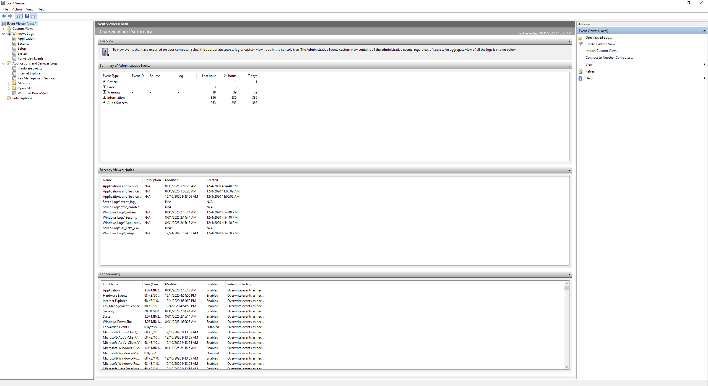
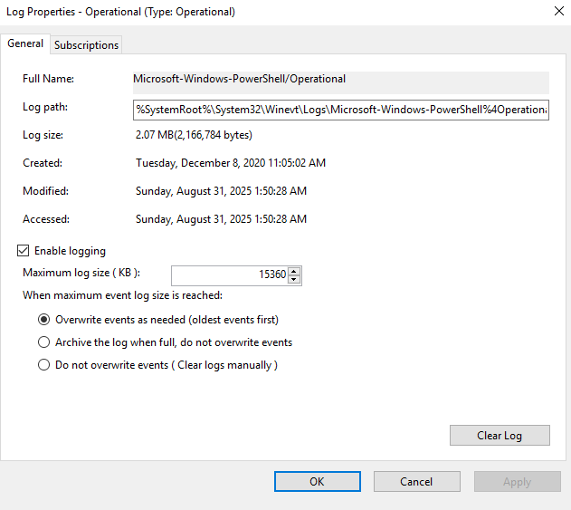
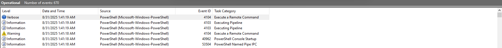
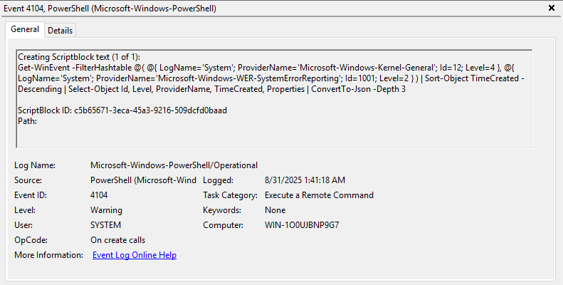

# Windows Event Logs

> Event logs record events taking place in the execution of a system that can be used to understand the activity of the system and to diagnose problems. They are essential to understand particularly in the case of applications with little user interaction.

<a herf="https://en.wikipedia.org/wiki/Logging_(computing)">Wikipedia.org</a>

This definition mostly applies to system administrators, technicians etc. In Cyber Security, Event Logs are used by blue teamers to analyze and correlate (unrelated) events on different servers. This is usually done by a SIEM.

Windows Event Logs are not presented as simple text files. They are stored in a proprietary binary format with an .evt or .evtx extension. To view them, built-in Windows tools can be used to translate them into XML. The log files usually can be found in ``C:\Windows\System32\winevt\Logs``.

There are 3 main ways of accessing event logs within a Windows system:

1. **Event Viewer**: GUI-based application
2. **Wevtutil.exe**: CLI Tool
3. **Get-WinEvent**: PowerShell cmdlet

## Windows Event Log Elements

Windows Event Logs are separated into different categories, each presenting logs to different activities on the system.

|Event Category|Description|
|:------------|:----------|
|**System Logs**|Records events associated with the OS. They may include information about hardware changes, device drivers, system changes and other activities related to the device that runs Windows|
|**Security Logs**|Records events connected to logon and logoff activities on a device. The system's audit policy specifies the events. The logs are an excellent source to investigate attempted or successful unauthorized activity.|
|**Application Logs**|Records events related to applications installed on a system. The majority of information revolves around application errors, events and warnings.|
|**Directory Service Events**|Active Directory changes and activities are recorded under this category. This can be found mostly on domain controllers.|
|**File Replication Service Events**|Records events associated with Windows Servers during the sharing of Group Policies and logon scripts to domain controllers, from where they may be accessed by users through clients.|
|**DNS Event Logs**|DNS servers use this category to record events regarding the DNS service.|
|**Custom Logs**|This category contains events logged by applications that require custom data storage. This enables applications to control the log size or attach other parameters, such as ACLs, for security purposes.|

The event logs can further be classified into different types. Types describe the activity in the event being logged.

|Event type|Description|
|:---------|:----------|
|**Error**|An event that indicates a significant problem such as loss of data or loss of functionality.|
|**Warning**|An event that is not necessarily significant, but can indicate a possible future problem.|
|**Information**|An event that describes the successful operation of an application, driver or service.|
|**Success Audit**|An event that records an audited security access attempt that is successful.|
|**Failure Audit**|An event that records an audited security attempt that fails.|

You can read more about these event types [here](https://learn.microsoft.com/en-us/windows/win32/eventlog/event-types).

## Viewing Event Logs

### Event Viewer

The **Event Viewer** is a built-in **MMC snap-in** on every GUI-based Windows System. It can be launched in many different ways, including typing ``eventvwr.msc`` into the search bar or CMD. It is a GUI-based application that allows you to interact quickly with and analyze logs.

The Event Viewer has three panes:

- The pane on the left that provides a hierarchical tree listing of the event log providers
- The pane in the middle will display a general overview and summary of the events specific to a selected provider
- The pane on the right is the actions pane

The standard logs discussed earlier are on the left pane visible under **Windows Logs**. The section below is the **Applications and Service Logs** section. Here you can find application- and service-specific logs like ``Microsoft > Windows > PowerShell > Operational``. (1)
{ .annotate }

1.  PowerShell logs operations from the engine, providers and cmdlets to this Windows event log.

The properties of this log show key information like:

- Log location
- Log size
- Creation time
- Last modified
- Last accessed
- Maximum log size and log size actions (e.g. log rotation)

The **Properties** menu also offers a way to clear the log. 

!!! note
    This is not the only method to remove the event logs for any given event provider.

Focusing on the middle pane of the Event Viewer. As this pane displays events specific to a selected provider, if  **PowerShell/Operational** is selected, the related events will be shown. You can see the name of the event provider as well as the number of logged events. The events itself within the list contains the following information:

- **Level**: Highlights the log recorded type based on the identified event types
- **Date and Time**: The time at which the event was logged
- **Source**: Name of the software that logs the event
- **Event ID**: A predefined numerical value that maps to a specific operation or event based on the log source. Event IDs are not unique.
- **Task Category**: Shows the Event Category. This can be used to organize and filter events.

The same pane also offers a detailed view of a select event. Any selected event will be displayed there and offers a **General** and a **Details** tab.

The **Actions Pane** to the right offers several options like **Create Custom View**. You can easily filter logs from there.(2)
{ .annotate }

2.  The **Filter Current Log** option is nearly identical to the **Create Custom View** one. The difference is that the ``By Log`` and ``By source`` radio buttons are greyed out in the **Filter Current Log** function.

