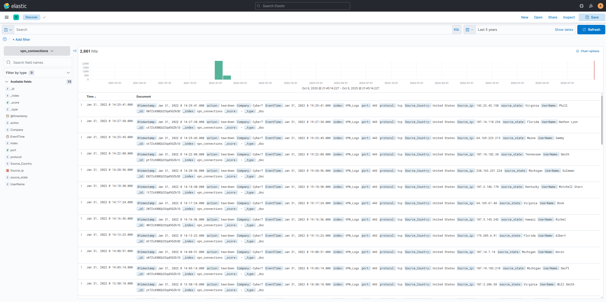
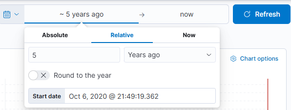
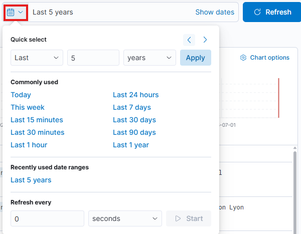
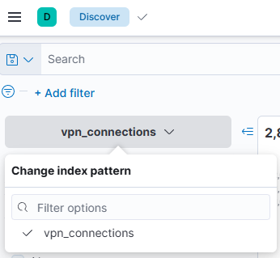

# Elastic Stack

The **Elastic Stack** is the collection of different open-source components linked together to help users take the data from any source and in any format, perform searches, analyze and visualize the data in real-time. 

## Elasticsearch

**Elasticsearch** is a full-text search and analytics engine used to store JSON-formatted documents. It is an important component used to store, analyze and perform correlation on data. Elasticsearch supports RESTful API to interact with the data.

## Logstash

**Logstash** is a data processing engine used to take the data form different sources, apply the filter on it or normalize it, then send it to the destination which could be [**Kibana**](#kibana) or a listening port. A **Logstash** configuration file is divided into three parts.

- [**Input**](https://www.elastic.co/guide/en/logstash/8.19/input-plugins.html): This part is where the source from which the data is being ingested is defined.
- [**Filter**](https://www.elastic.co/guide/en/logstash/8.19/filter-plugins.html): This part is where filter options to normalize the ingested logs is specified.
- [**Output**](https://www.elastic.co/guide/en/logstash/8.19/output-plugins.html): This part describes where the filtered data is being send to. It can be a listening port, Kibana Interface, Elasticsearch database, a file etc. Logstash supports many output plugins.

## Beats

**Beats** is a host-based agent known as *Data-shippers* that is used to *ship* or *transfer* data from endpoints to Elasticsearch. Each beat is a single-purpose agent that sends specific data to the Elasticsearch. You can find alle existing **Beats** by looking at the [official documentation](https://www.elastic.co/guide/en/beats/libbeat/8.19/beats-reference.html).

## Kibana

**Kibana** is a web-based data visualization that works with Elasticsearch to analyze, investigate and visualize the data stream in real-time. It allows users to create multiple visualizations and dashboards for better visibility.

### Kibana Discovery Tab

The **Kibana** Discovery tab is a place where the ingested logs, the search bar, normalized fields etc can be found.(1) The following tasks can be performed here:
{ .annotate }

1. The ingested logs are also known as **documents**.

- Search for the logs
- Investigate anomalies
- Apply filter based on:
  - Search terms
  - Time periods

It contains the logs being ingested manually or in real-time, the time-chart, normalized fields and more. 

#### Time Filter

The **Time filter** provides a way to apply a log filter based on the time. It has different options on how to select the timeframe.

#### Quick Select

The **Quick Select Tab** is another useful tab within Kibana that offers multiple predefined timeframe options to select from. 

#### Timeline

The **Timeline** pane provides an overview of the number of the events that occurred for the selected time/data. The bar can be selected to show only the logs of the selected period. The count at the top left displays the number of documents/events that have been found in that timeframe.

#### Index Pattern

Kibana, by default, requires an index pattern to access the data stored or being ingested in the Elasticsearch. **Index Patterns** tell Kibana which Elasticsearch data should be explored. Each pattern corresponds to certain defined properties of the fields. A single pattern can point to multiple indices.

Each log source has a different log structure, therefore, when logs are ingested in Elasticsearch, they are first normalized into corresponding fields and values by creating a dedicated index pattern for the data source.

#### Left Panel - Fields

The left panel of the Kibana Discovery interface shows the list of the normalized fields it finds in the available document/logs. Select any field, and the Top 5 values and the percentages of the occurrences will be shown.

!!! tip
    These values can be used to apply filters to them by clicking on the **+** button to show logs containing this value.

### KQL - Kibana Query Language

The **KQL** is a search query language used to search the ingested documents in Elasticsearch. Apart from the KQL language, Kibana also supports **Lucene Query Language**. 

!!! note
    You can disable the KQL by clicking on the KQL button next to the search bar.

|Operators|Description|Example Query|
|:--------|:----------|:------------|
|**Wild Card**|KQL allows the wild card ``*`` to match parts of the term/word.|``Nginx*``|
|**OR**|The ``OR`` operator shows logs that contain one or another search term.|``"Nginx" OR "httpd"``|
|**AND**|The ``AND`` operator shows logs that contain one and another search term.|``"Nginx" AND "httpd"``|
|**NOT**|THe ``NOT`` operator removes a term from the search results.|``"Nginx" AND NOT("httpd")``|

#### Free text search

Free text search provides a way to search for the logs based on the **text-only**. That means the search will return all documents that contains the search term, irrespective of the field.

#### Field-based search

The Field-based search works by providing the field name and a value that is being looked for in the logs. The syntax is ``FIELD:VALUE``, where the ``:`` operator is the separator between the field and the value.
