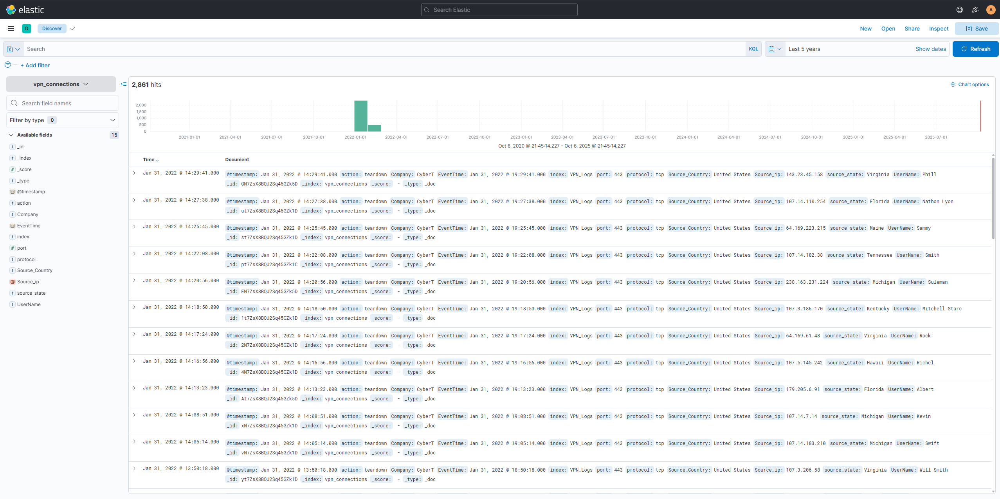
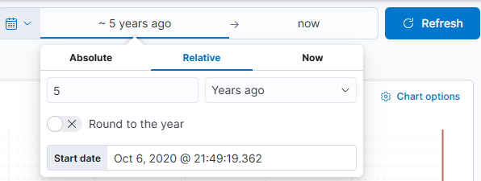
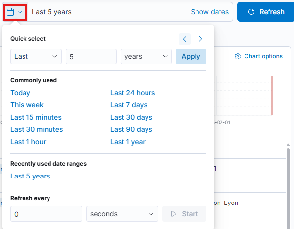
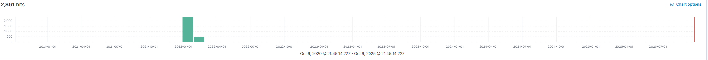
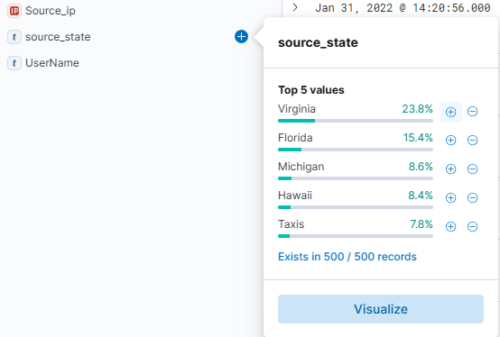

# Security Information and Event Management system

A **SIEM** is a tool that collects data from various endpoints and network devices across an network, stores them at a centralized place and performs correlation on them.

## What is a SIEM

A SIEM is based on working with logs. It can use **Host-Centric** and **Network-Centric** log sources. Devices that generate these logs will generate hundreds of events per second, which can be a very tedious task when, for example, logs need to be investigated after an incident. A SIEM takes logs from all these various sources in real-time and provides the ability to **correlate** between events, **search** through the logs, **investigate** incidents and **respond** promptly to them. Other key features are:

- Real-time log Ingestion
- Alerting against abnormal activities
- 24/7 Monitoring and visibility
- Protection against the latest threats through early detection
- Data Insights and visualization
- Ability to investigate past incidents

### Log Sources and Log Ingestion

Every device in a network generates logs when certain activities are performed, like visiting a website or establishing an SSH connection. Windows provides its logs through the [**Windows Event Viewer](../endpoint-security/windows/windows_event_logs.md). With Linux the location of the logs can vary. Some common location are for example:

|Path|Description|
|:---|:----------|
|``/var/log/httpd``|Contains HTTP Requests and the response/error logs.|
|``/var/log/cron``|Events related to cron jobs are stored in this location.|
|``/var/log/auth.log`` and ``/var/log/secure|Stores authentication related logs.|
|``/var/log/kern``|This log stores kernel related events.|

!!! info

    Please be aware that Web Server related logs can vary depending on the web server software in use. **nginx** for example stores its logs in ``/var/log/nginx``.

All these logs provide a wealth of information and cen help identifying security issues. Each SIEM solution has its own way of ingesting these logs. 

|Log Ingestion Method|Description|
|:-------------------|:----------|
|**Agent / Forwarder**|The SIEM provides a lightweight tool called an **agent** that gets installed on the endpoint device. It is configured to capture all important and relevant logs and send them to the SIEM.|
|**Syslog**|Syslog is a widely used protocol to collect data from various systems like web servers and databases. These are sent in real-time to the centralized destination.|
|**Manual Upload**|Some solutions, like Splunk and ELK allow users to ingest offline data for quick analysis. Once the data is ingested, it is normalized and made available for analysis.|
|**Port-Forwarding**|Some solutions can be configured to listen on a certain port, and then the endpoints forward the data to the SIEM instance on the listening port directly.|

### Analyzing Logs and Alerts

Once the logs are ingested, a SIEM looks for unwanted or suspicious patterns within the logs with the help of conditions set in rules by analyst and experts. If a condition is met, a rule gets triggered and an incident can be investigated.

!!! info
    Usually every SIEM provides a **Dashboard** which presents a summary of the data after being normalized and ingested. Each SIEM comes with a default dashboard an an option for custom dashboards.

**Correlation rules** are logical expression set to be triggered and play an important role in the timely detection of threats. This can be for example

- If a User gets 5 failed Login Attempts in 10 seconds -> Raise an alert for *Multiple Failed Login Attempts*
- If login is successful after multiple failed login attempts -> Raise an alert for *Successful Login after multiple Login Attempts*
- A rule is set to alert every time a user plugs in a USB device
- If outbound traffic is greater than 25 MB -> Raise an alert to potential Data exfiltration Attempt

!!! tip
    A unique Windows Event ID to track is the ID **104**. This is logged every time a user tries to remove or clear event logs.

## Elastic Stack

The **Elastic Stack** is the collection of different open-source components linked together to help users take the data from any source and in any format, perform searches, analyze and visualize the data in real-time. 

### Elasticsearch

**Elasticsearch** is a full-text search and analytics engine used to store JSON-formatted documents. It is an important component used to store, analyze and perform correlation on data. Elasticsearch supports RESTful API to interact with the data.

### Logstash

**Logstash** is a data processing engine used to take the data form different sources, apply the filter on it or normalize it, then send it to the destination which could be [**Kibana**](#kibana) or a listening port. A **Logstash** configuration file is divided into three parts.

- [**Input**](https://www.elastic.co/guide/en/logstash/8.19/input-plugins.html): This part is where the source from which the data is being ingested is defined.
- [**Filter**](https://www.elastic.co/guide/en/logstash/8.19/filter-plugins.html): This part is where filter options to normalize the ingested logs is specified.
- [**Output**](https://www.elastic.co/guide/en/logstash/8.19/output-plugins.html): This part describes where the filtered data is being send to. It can be a listening port, Kibana Interface, Elasticsearch database, a file etc. Logstash supports many output plugins.

### Beats

**Beats** is a host-based agent known as *Data-shippers* that is used to *ship* or *transfer* data from endpoints to Elasticsearch. Each beat is a single-purpose agent that sends specific data to the Elasticsearch. You can find alle existing **Beats** by looking at the [official documentation](https://www.elastic.co/guide/en/beats/libbeat/8.19/beats-reference.html).

## Kibana

**Kibana** is a web-based data visualization that works with Elasticsearch to analyze, investigate and visualize the data stream in real-time. It allows users to create multiple visualizations and dashboards for better visibility.

### Kibana Discovery Tab

The **Kibana** Discovery tab is a place where the ingested logs, the search bar, normalized fields etc can be found.(1) The following tasks can be performed here:
{ .annotate }

1. The ingested logs are also known as **documents**.

- Search for the logs
- Investigate anomalies
- Apply filter based on:
  - Search terms
  - Time periods

It contains the logs being ingested manually or in real-time, the time-chart, normalized fields and more. 

#### Time Filter

The **Time filter** provides a way to apply a log filter based on the time. It has different options on how to select the timeframe.

#### Quick Select

The **Quick Select Tab** is another useful tab within Kibana that offers multiple predefined timeframe options to select from. 

#### Timeline

The **Timeline** pane provides an overview of the number of the events that occurred for the selected time/data. The bar can be selected to show only the logs of the selected period. The count at the top left displays the number of documents/events that have been found in that timeframe.

#### Index Pattern

Kibana, by default, requires an index pattern to access the data stored or being ingested in the Elasticsearch. **Index Patterns** tell Kibana which Elasticsearch data should be explored. Each pattern corresponds to certain defined properties of the fields. A single pattern can point to multiple indices.

Each log source has a different log structure, therefore, when logs are ingested in Elasticsearch, they are first normalized into corresponding fields and values by creating a dedicated index pattern for the data source.

#### Left Panel - Fields

The left panel of the Kibana Discovery interface shows the list of the normalized fields it finds in the available document/logs. Select any field, and the Top 5 values and the percentages of the occurrences will be shown.

!!! tip
    These values can be used to apply filters to them by clicking on the **+** button to show logs containing this value.

