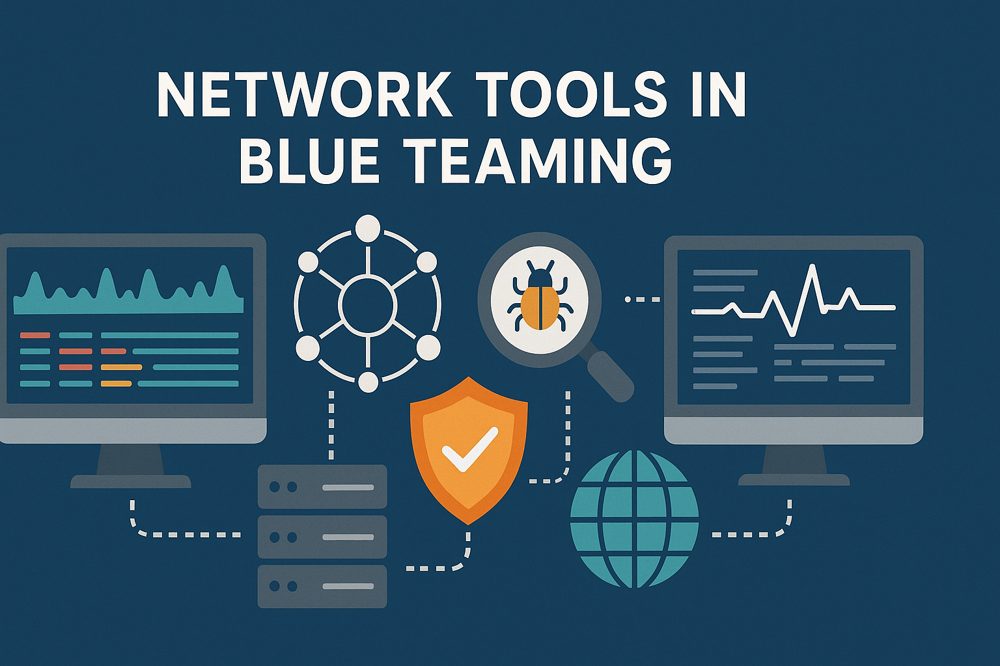

# Blue Teaming - Network Tools

In the context of Blue Teaming, network tools are essential for monitoring, defending, and analyzing network traffic to detect and respond to cyber threats. Tools like [Wireshark](wireshark/wireshark.md), [Zeek](zeek.md) and others are used to inspect packet data, identify anomalies, and correlate events across systems. By leveraging

-  Intrusion detection systems (IDS)
-  Network monitoring solutions
-  and Traffic analyzers
  
Blue Teams can proactively identify malicious behavior, enforce security policies, and ensure the integrity and confidentiality of the network infrastructure.
