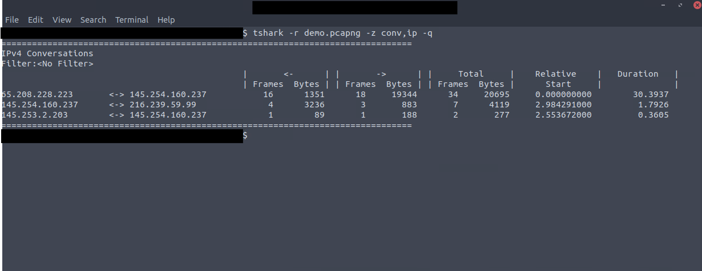

# TShark CLI Wireshark Features

## Statistics

As explained in [TShark Basics](./tshark_basics.md), it is considered the CLI version of Wireshark. That means that TShark can accomplish several features of Wireshark.

!!! note
    The following options apply to all packets in scope unless a *Display Filter* is provided. 

|Parameters|Description|Example|
|:---------|:----------|:------|
|`--color`|Wireshark-like colorized output|`tshark --color`|
|`-z`|Shows statistics. The parameters offers multiple options which can be viewed using `tshark -z help`. You can suppress the packets and focus on the statistics using the `-q` parameter. |`tshark -z filter`|

Some interesting statistics options are:

|Statistics option|Function|
|:----------------|:-------|
|`-z plen,tree`|Shows the package length by size in a tree format
|`-z io,phs`|Shows the protocol hierarchy|
|`-z io,phs,udp`|Filters the protocol hierarchy for UDP packages|
|`-z endpoints,ip`|Providing a summarized view of the endpoints by IPv4 addresses|
|`-z endpoints,eth`|Providing a summarized view of the endpoints by Ethernet addresses|
|`-z endpoints,ipv6`|Providing a summarized view of the endpoints by IPv6 addresses|
|`-z endpoints,tcp`|Providing a summarized view of the endpoints by TCP addresses. Works for IPv4 and IPv6.|
|`-z endpoints,udp`|Providing a summarized view of the endpoints by UDP addresses. Works for IPv4 and IPv6.|
|`-z endpoints,wlan`|Providing a summarized view of the endpoints by IEEE 802.11 addresses|

A few mre interesting statistics are:

- `-z conv` : This view provides an overview of the traffic flow between to particual connection points. Similar to the endpoint filtering, conversations can be viewed in multiple formats like `-z conv,ip`
- `-z expert`: This view helps you to view automatic comments provided by Wireshark. 

!!! tip "Focusing on the statistics"
    Don't forget to use the `-q` parameter to suppress the packets themselves and focus on the statistics you want to see like `tshark -r test.pcap -z expert -q`

/// caption
TShark Statistics Example
///

