# Wireshark

> Wireshark is a powerful, open-source network protocol analyzer that allows users to capture and interactively browse the traffic running on a computer network, providing deep inspection of hundreds of protocols. As an open-source tool, Wireshark is freely available for use and distribution, with its source code accessible under the GNU General Public License (GPL).

<a herf="https://www.wireshark.org/">wireshark.org</a>

## The Basics

### Use Cases

Wireshark is one, if not the most potent traffic analyser tools available. It is often used for

- Detecting and troubleshooting network problems, such as network load failure points and congestion.
- Detecting security anomalies, such as rogue hosts, abnormal port usage, and suspicious traffic.
- Investigating and learning protocol details, such as response codes and payload data. 

!!! note
    Wireshark is not an Intrusion Detection System (IDS). It only allows analysts to discover and investigate the packets in depth. It also doesn't modify packets; it reads them. Hence, detecting any anomaly or network problem highly relies on the analyst's knowledge and investigation skills.

### GUI and data

The wireshark GUI opens with a single all-in-one page, which provides a way for users to investigate traffic. There are 5 important sections at first glance:

- **Toolbar**: The main toolbar contains menus and shortcuts for packet sniffing and processing, including filtering, sorting summarising, exporting and merging.
- **Display Filter Bar**: This bar is the main query and filtering section.
- **Recent Files**: This is a list of recently investigated files. (1)
- **Capture Filter and Interfaces**: Here you can find capture filters and available sniffing points (network interfaces). The interface is a connection between a system and a network.
- **Status Bar**: Provides the Tool status, profile and numeric packet informations.

1.  You can recall listed files with a double-click.

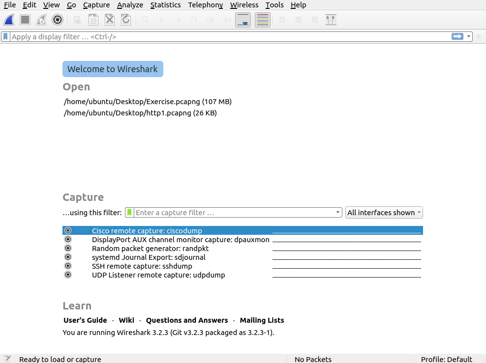

### Loading PCAP files

When we load a pcap file, whireshark shows its potential.

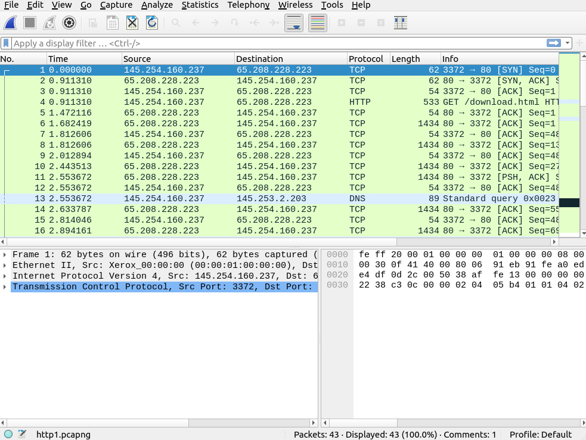

Here you can see the processed filename, detailed number of packets and the packet details. These are separated into 3 different panes.

- **Packet list Pane**: Provides a summary of each packet. You can click on the list to choose a packet for further investigation. Selecting a packet here will show its information in the other panes.
- **Packet details Pane**: Shows a detailed protocol breakdown for the selected packet.
- **Packet Bytes Pane**: Shows Hex and decoded ASCII representation of the packet. It also highlights the packet field depending on the clicked section in the details pane.

### Coloring Packets
Wireshark colors packets in order of different conditions and the used protocol to make it easier for spotting anomalies and protocols within the capture. Wireshark uses 2 types of packet coloring methods:

- Temporary rules that are only available during a program session
- Permanent rules that are saved under the preference file (profile)

You can get to the Coloring Rules Menu by opening the **right-click menu** or via **View--> Coloring Rules** to create permanent rules. Temporary rules can also be created within the right-click menu or **View-->Conversation Filter**.

### Traffic Sniffing
Using the **shark button**, Whireshark can start a network sniffer to capture traffic. Pressing the red button will stop the capture process and the green one restarts it.

### Merging and File Details
Wireshark can also be used to merge two pcap files into a single one as well as displaying file details. This is especially helpful when working with multiple pcap files.

- To merge to files, you can use **File-->Merge**
- To see the file details, you can use **Statistics--> Capture File Properties** or by clicking the **pcap icon located on the left bottom** of the window

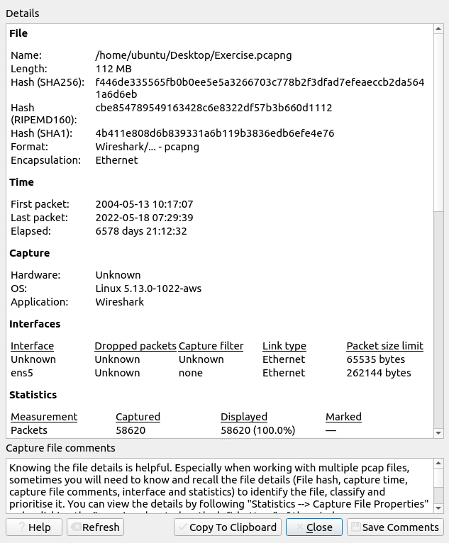

## Package navigation

### Dissect packages
Packet dissection, also called **protocol dissection**, is the process of investigating packet details by decoding available protocols and fields. You can find more details on dissection [here](https://github.com/boundary/wireshark/blob/master/doc/README.dissector).

You can double-click on a packet in the packet. list pane to open its details. Packets consists of 5 to 7 layers based on the OSI model. You can see the seven distinct layers:

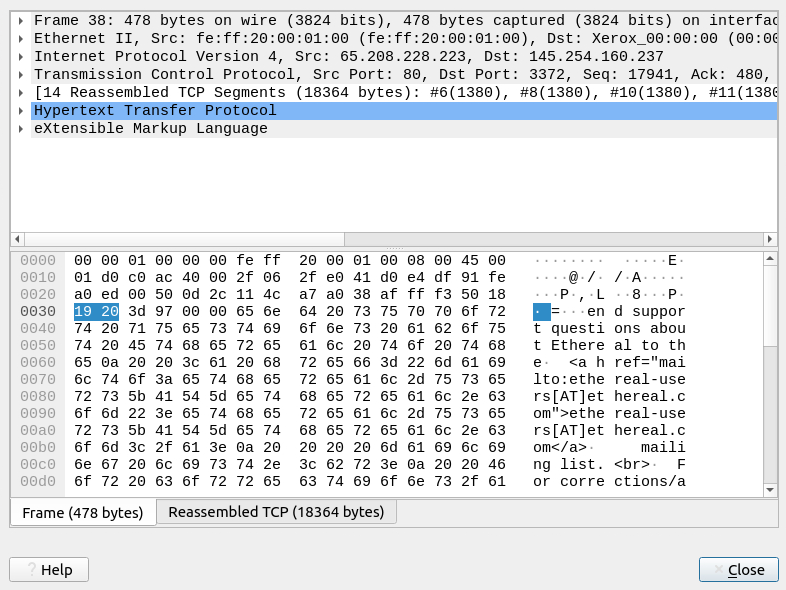

### Package navigation

Wireshark assigns all investigated packets a unique number. This makes analyzing for big captures way easier. You can navigate to a packet using this number by using the **Go** menu in the menu bar.

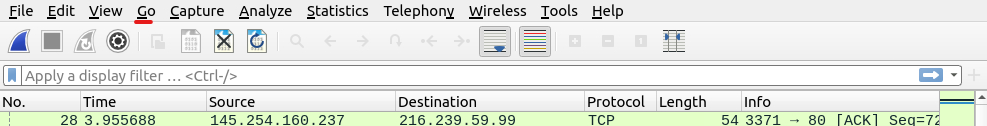

Using this function, you can also find the next packet in that particular part of the conversation.  
To find packets by content, you can use the **Edit --> Find packet** menu to start a search inside packets for specific events. Searching packets comes with 2 important points:

1. **Input Type**: This functionality accepts four types of inputs
   1. Display Filter
   2. Hex
   3. String
   4. Regex
2. **Search field**: You can conduct searches in the three panes.
   1. Packet list
   2. Packet details
   3. Packet bytes

!!! note
    It is important to know the available information in each pane to find specific events. For example, if you try to find the available information within the packet details pane and conduct the search in the packet list pane, Wireshark won't find it, even if it exists.

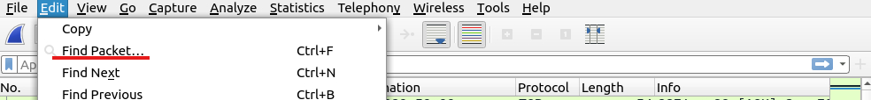

### Mark packages

Marking packages is used to point to an event of interest or export particular packets from capture. You an use the **Edit** or the **right-click** menu to mark or unmark packets.

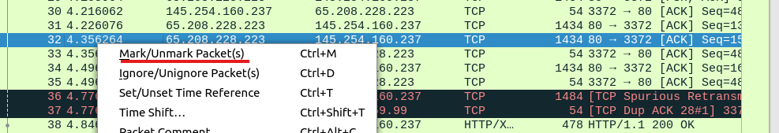

### Export info

Wireshark also detects specific states of protocols and makes it easy for analysts to spot anomalies and problems. These are only suggestions and there is a risk of having false positives and negatives.

Based on a Color Scheme, the are 4 different severities.

|Severity|Color|Info|
|:-------|:----|:---|
|Chat|Blue|Information on usual worflow|
|Note|Cyan|Notable events like application error codes|
|Warn|Yellow|Warnings like unusual error codes or problems|
|Error|Red|Problems like malformed packets|

You can use the **lower left bottom section** in the status bar or **Analyse --> Expert Information** menu to view all available information entries via a dialogue box.

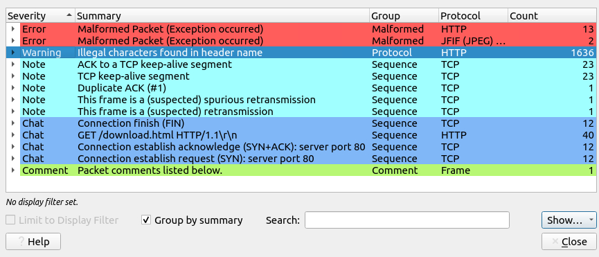

## Package filtering

Wireshark has a powerful filter engine that assists analyst to narrow down the traffic and focus on specific events. It uses 2 types of filtering:

1. **Capture filter**: These are used for *capturing* only valid packets in regard to the filter.
2. **Display filter**: These are used to *view* only the valid packets in regard to the filter.

You can filter using queries or the right-click menu. Wireshark uses the approach **If you can click it, you can filter and copy it."

### Apply as filter

The most basic way of filtering is to click on the field you want to filter and use the **right-click** menu or **Analyze --> Apply as Filter** to filter for the specific value. Based on your selection Wireshark starts to generate your filter as query, applies it and shows you the relevant packages.

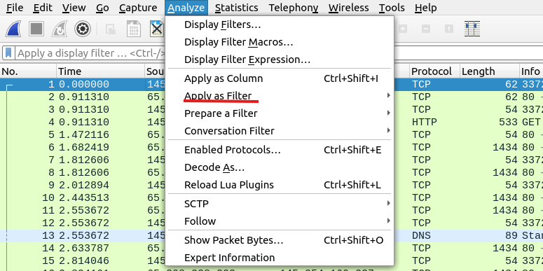

### Conversation Filter
Using the *Apply as a Filter* function only filters for a single entity of the packet. This option is good for investigating particular values in packets. To investigate a specific packet number and its linked packages by focusing on IP addresses and port numbers you can use **Conversation Filters**. These filters can be access via the **right-click** menu or using **Analyse --> Conversation Filter**.

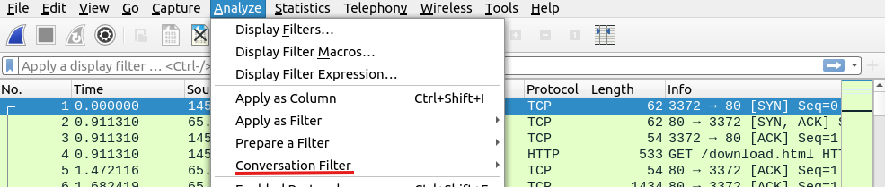

You can also highlight linked packets without applying a display filter and decreasing the number of viewed packets. This can be done via the **right-click** menu or using **View --> Colorize Conversation**.

### Prepare as filter

This is similar to the [Apply as Filter](#apply-as-filter). The difference between both filters is that the *apply as filter* doesn't apply the filters after the choice. It adds the quiry to the pane and waits for execution. You can add more filters using the **and/or** from the right-click menu.

### Apply as Column
 
 By default, the packet list pane provides basic information about each packet. You can use the **right-click** meni or **Analyse --> Apply as Column** to add columns to the packet list pane.

 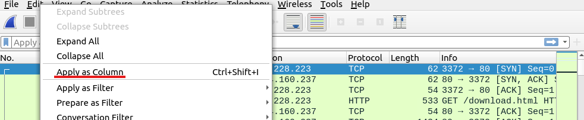

 ### Follow Stream

 Wireshark displays everything in packet portion sizes. It is possible to reconstruct the streams and view raw traffic as it is presentated at the application level. Following the protocol, streams are used to recreate application-level data and understand specific events. It is also possible to view the unencrypted protocol data like usernames, passwords and other data.

 You can access this using the **right-click** menu or **Analyse --> Follow TCP/UDP/HTTP Stream**. Streams are shown in a separate dialogue box.

 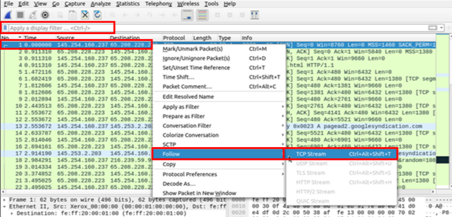