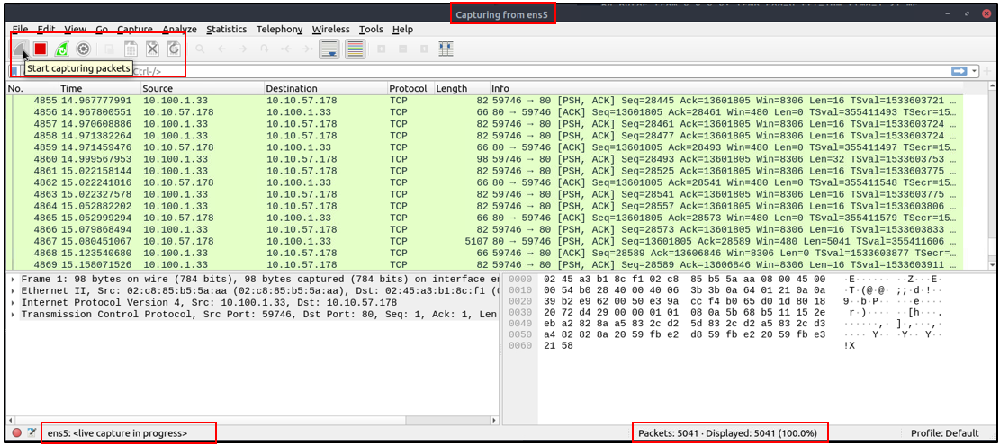

# Wireshark

> Wireshark is a powerful, open-source network protocol analyzer that allows users to capture and interactively browse the traffic running on a computer network, providing deep inspection of hundreds of protocols. As an open-source tool, Wireshark is freely available for use and distribution, with its source code accessible under the GNU General Public License (GPL).

<a herf="https://www.wireshark.org/">wireshark.org</a>

## The Basics

### Use Cases

Wireshark is one, if not the most potent traffic analyser tools available. It is often used for

- Detecting and troubleshooting network problems, such as network load failure points and congestion.
- Detecting security anomalies, such as rogue hosts, abnormal port usage, and suspicious traffic.
- Investigating and learning protocol details, such as response codes and payload data. 

!!! note
    Wireshark is not an Intrusion Detection System (IDS). It only allows analysts to discover and investigate the packets in depth. It also doesn't modify packets; it reads them. Hence, detecting any anomaly or network problem highly relies on the analyst's knowledge and investigation skills.

### GUI and data

The wireshark GUI opens with a single all-in-one page, which provides a way for users to investigate traffic. There are 5 important sections at first glance:

- **Toolbar**: The main toolbar contains menus and shortcuts for packet sniffing and processing, including filtering, sorting summarising, exporting and merging.
- **Display Filter Bar**: This bar is the main query and filtering section.
- **Recent Files**: This is a list of recently investigated files. (1)
- **Capture Filter and Interfaces**: Here you can find capture filters and available sniffing points (network interfaces). The interface is a connection between a system and a network.
- **Status Bar**: Provides the Tool status, profile and numeric packet informations.

1.  You can recall listed files with a double-click.

### Loading PCAP files

When we load a pcap file, whireshark shows its potential.

Here you can see the processed filename, detailed number of packets and the packet details. These are separated into 3 different panes.

- **Packet list Pane**: Provides a summary of each packet. You can click on the list to choose a packet for further investigation. Selecting a packet here will show its information in the other panes.
- **Packet details Pane**: Shows a detailed protocol breakdown for the selected packet.
- **Packet Bytes Pane**: Shows Hex and decoded ASCII representation of the packet. It also highlights the packet field depending on the clicked section in the details pane.

### Coloring Packets
Wireshark colors packets in order of different conditions and the used protocol to make it easier for spotting anomalies and protocols within the capture. Wireshark uses 2 types of packet coloring methods:

- Temporary rules that are only available during a program session
- Permanent rules that are saved under the preference file (profile)

You can get to the Coloring Rules Menu by opening the **right-click menu** or via **View--> Coloring Rules** to create permanent rules. Temporary rules can also be created within the right-click menu or **View-->Conversation Filter**.

### Traffic Sniffing
Using the **shark button**, Whireshark can start a network sniffer to capture traffic. Pressing the red button will stop the capture process and the green one restarts it.

### Merging and File Details
Wireshark can also be used to merge two pcap files into a single one as well as displaying file details. This is especially helpful when working with multiple pcap files.

- To merge to files, you can use **File-->Merge**
- To see the file details, you can use **Statistics--> Capture File Properties** or by clicking the **pcap icon located on the left bottom** of the window

