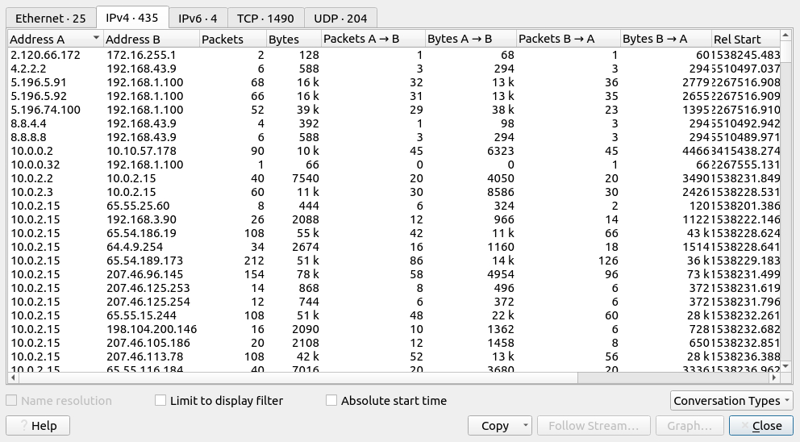

# Wireshark - Advanced Features

## Statistics

The statistics menu provides multiple statistics options to investigate and help users see the big picture regarding the scope of the traffic, available protocols, endpoints and conversations as well as some protocol-specific details like DHCP, DNS and HTTP. 

### Resolve Addresses

Resolving addresses helps to identify addresses and DNS names available in the capture files by providing the list of the resolved addresses and their hostnames. You can quickly identify accessed resources by using this menu and evaluate these ressources according to the event. This option is available through the **Statistics --> Resolved Addresses** menu.

!!! tip
    Select *Hosts* like in the picture above to filter correctly.

### Protocol Hierarchy

This can be used to break down all available protocols from the capture file and provided a tree view based look into the protocols regarding packet counters and percentages. 

!!! tip
    You can **right-click** within this menu to filter specific events.

### Conversations

A conversation represents traffic between to specific endpoints. This option provides the list of the conversation in 5 base formats:

1. Ethernet
2. IPv4
3. IPv6
4. TCP
5. UDP

You can access this menu via **Statistics --> Conversations**.

### Endpoints

The endpoints option is similar to the [Conversations](#conversations) option. The difference between the two is that endpoints provides unique information for a single information field (Ethernet, IPv4, IPv6, TCP and UDP). This can be accessed via the **Statistics --> Endpoints** menu.
Wireshark also supports resolving MAC addresses into human-readable format using the manufacturer that is assigned by the IEEE. This only works for the *known* manufacturers.

The name resolution is not limited to only MAC addresses. Wireshark also offers IP and port name resolution options as well, altough these options are not enabled by default. You can access these settings via the **Edit --> Preferences --> Name Resolution** menu.

Additionally, Wireshark also provides an IP geolocation mapping to identify the geolocation of source and destination addresses. This feature is also not enabled by default and needs additional data from services like the GeoIP database. Wireshark currently supports MaxMind databases and the lastest version comes configured with a MaxMind DB resolver. You still need to provide the DB files and provide this database to Wireshark using **Edit --> Preferences --> Name Resolution --> MaxMind database directories**.

### IPv4 and IPv6

Until now, almost all options provided information that contained both IPv4 and IPv6. The statistics menu has 2 options to narrow down the statistics on packets containig a specific IP version. This way you can identify and list all events linked to specific IP versions in a single windows. This can be accessed via the **Statistics --> IPvX Statistics** menu.

### DNS

Wireshark offers an option to break down all DNS packets from the capture file and provides the findings in a tree view based on packet counters and percentages of the DNS protocol. You can use this to view the DNS overall usage, including:

- rcode
- opcode
- class
- query type
- service
- query stats

This option can be accessed via the **Statistics --> DNS** menu.

### HTTP

This function breaks down all HTTP packets from the capture file and helps to view the findings in a tree view based on packet counters and percentages of the HTTP protocol. You cann access this via the **Statistics --> HTTP** menu.

!!! tip
    Don't forget to scroll sideways within this windows!

## Packet Filtering with queries

If you dont remember the basics about filtering, check the [Wireshark Basics for filtering](wireshark.md/#package-filtering).

The typical use case is to capture everything and filter the captured packets. But you can also filter while sniffing the traffic.

!!! info
    You cannot use the display filter expressions for capturing traffic and vice versa.

### Capture Filter Syntax

These filters use byte offests hex values and masks with boolean operators, which makes it harder to understand the filters purpose at first glance. The base syntax is as follows:

- **Scope**: host, net, port and port range
- **Direction**: src, dst, srtc or dst, src and dest
- **Protocol**: ether, wlan, ip, ip6, rarp, tcp and udp
- **Sample filter to capture port 80 traffic**: `tcp port 80`

You can read more about capture filter syntax in the offical Wireshark documentation [here](https://www.wireshark.org/docs/man-pages/pcap-filter.html) and [here](https://gitlab.com/wireshark/wireshark/-/wikis/CaptureFilters#useful-filters). A quick reference is available with the **Capture --> Capture Filters** menu.

#### Display Filter Syntax

This feature supports 3000 protocols and allows conducting packet-level searches under the protocol breakdown. The offical [Display Filter Reference](https://www.wireshark.org/docs/dfref/) provides all supported protocols for filtering. 

??? example "Sample filter to capture port 80 traffic"
    `tcp.port == 80`

Wireshark offers a built-in option that stores all supported protocol structures to help create display filters (Display Filter Expression). You can access these using the **Analyse --> Display Filters** menu.

#### Comparison Operators

The primary operators used by display filters are listed in the following table.

|English|C-Like|Description|Example|
|:------|:-----|:----------|:------|
|eq|==|Equal|`ip.src == 10.10.10.10`|
|ne|!=|Not equal|`ip.src != 10.10.10.10`|
|gt|>|Greater than|`ip.ttl > 250`|
|lt|<|Less than|`ip.ttl < 10`|
|ge|>=|Greater than or equal to|`ip.ttl >= 0xFA`|
|le|<=|Less than or equal to|`ip.ttl <= 0xA`|

!!! note
    Wireshark supports decimal and hexadecimal values in filtering. You can use any format you want according to the search you will conduct.

#### Logical Expressions

Wireshark also supports boolean syntax by using logical operators while creating and using display filters.

|English|C-Like|Description|Example|
|:------|:-----|:----------|:------|
|and|&&|Logical AND|`(ip.src == 10.10.10.10) AND (ip.src == 10.10.0.0)`|
|or|\|\||Logical OR|`(ip.src == 10.10.10.10) OR (ip.src == 10.10.0.0)`|
|not|!|Logical NOT|`!(ip.src == 10.10.0.2)`|

!!! info
    The usage of `!value` is deprecated and using it could provide inconsistent results. Using the `!(value)` style is suggestet for more conistent results.

### Packet Filter Toolbar

The filter toolbar is the place where you create and apply your display filters. It is a smart toolbar that helps create valid display filters. Be aware of the following:

- Packet filters are defined in *lowercase*
- Packet filters have an autocomplete feature which breaks down protocol details and each detail is represented by a *dot*
- Packet filters have a 3-color represenation

|Color|Explanation|
|:----|:----------|
|Green|Valid filter|
|Red|Invalid filter|
|Yellow|Warning filter, meaning the filter works but is unreliable and should be changed.|

### IP Filters

IP filters help you to filter traffic according to the IP level information from packets (in regards to the OSI model). This filter is one of the more commonly used filters that Wireshark provides. It can filter based on network-level information like

- IP addresses
- Version
- TTL
- Type of service
- Flags
- Checksum values

Some common filters are

|Filter|Description|
|:-----|:----------|
|`ip`|Shows all IP packets|
|`ip.addr == 10.10.10.10`|Shows all packets containing the given IP address|
|`ip.addr == 10.10.10.0/24`|Shows all packets containing addresses from the given subnet|
|`ip.src == 10.10.10.10`|Shows all packets with the given IP address as the source|
|`ip.dest = 10.10.10.10`|Shows all packets with the given IP address as the destination|

!!! note
    The difference between `ip.addr` and `ip.src`/`ip.dest` is that former filters without considering the direction of the traffic.

### TCP and UDP filters

TCP filters exist to filter the traffic according to the protocol level information in regards to the Transport layer of the OSI model. These filters can filter based on transport protocol information like

- Source and destination ports
- Sequence numbers
- Acknowledgement numbers
- Windows size
- Timestamps
- Flags
- Length
- Protocol errors

Some example filters are:

|Filter|Description|
|:-----|:----------|
|`tcp.port == 80`|Shows all TCP packets with port 80|
|`tcp.srcport == 443`|Shows all TCP packets with the source port 443|
|`tcp.destport == 80`|Shows all TCP packets with the destination port 80|
|`udp.port == 1337`|Shows all UDP packets with the port 53 (1)|

1. UDP can be used analog to TCP

### Application Level Protocol Filters - HTTP and DNS

Similar to TCP and UDP filters, *Application-level* protocol filters are used to filter traffic based on the applicaiton protocol level information. This can be information like the payload and linked data.

|Filter|Description|
|:-----|:----------|
|`http`|Shows all HTTP packets|
|`http.response.code == 200`|Shows all packages with the HTTP response code *200*|
|`http.request.method == "GET"`|Shows all HTTP GET requests|
|`http.request.method == "POST"`|Shows all HTTP POST requests|
|`dns`|Shows all DNS packets|
|`dns.flags.response == 0`|Shows all DNS requests|
|`dns.flags.response == 1`|Shows all DNS responses|
|`dns.qry.type == 1`|Shows all DNS **A** records|

### Display Filters Expression

Wireshark provided a built-in option that stores all supported protocol structures to assist in creating display filters. If you don't recall the required filter or you are unsure, you can access this menu using **Analyse --> Display Filter Expressions**.

