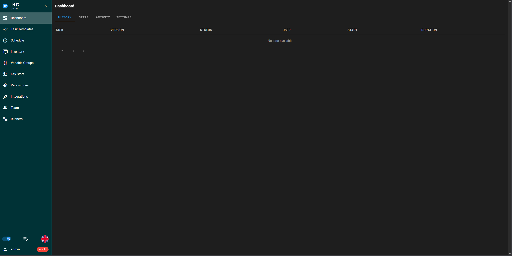
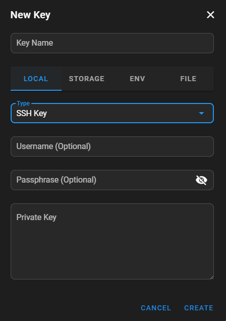
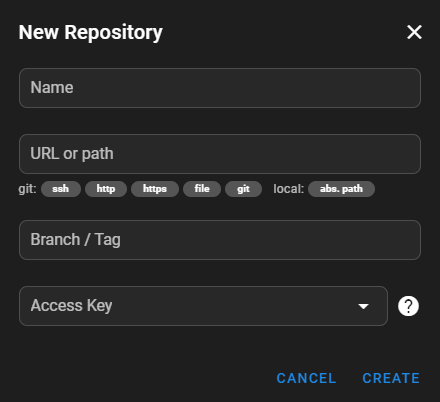
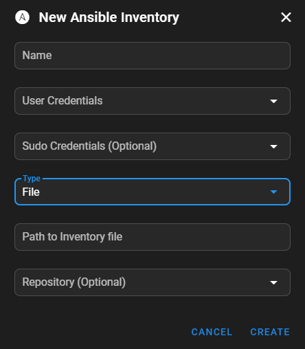
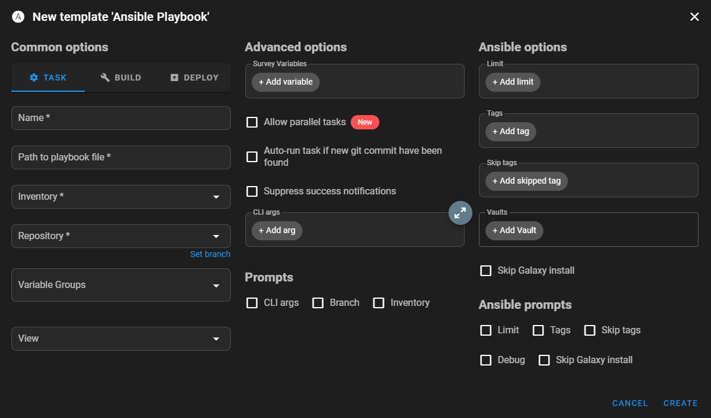
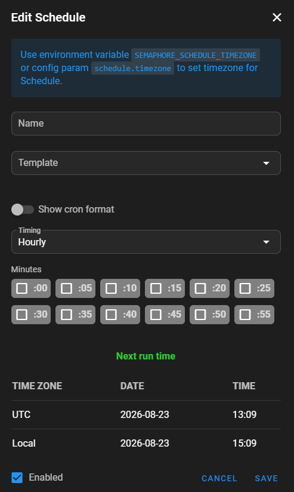

# Semaphore Setup Guide - AlmaLinux 10

Even though [Ansible](index.md) is a very good automation tool it certainly lacks the modern approach of managing it. This is where [Semaphore](https://semaphoreui.com/) comes into play. It builds upon the Ansible toolset and extends it with

- A web-based GUI to interact with Ansible
- Easy Inventory, User and Playbook Management
- Key Management including a database where SSH Keys & passwords can be stored securely
- Scheduling and logging of Task Executions with various integration to always be notified about problems with ansible

It even comes with Repository Management and Git Integrations which makes versioning tasks and inventories trivial.

This guide will therefore show the installation and setup of Semaphore. It is recommended by Semaphore itself to use the docker installation since its simplicity makes it an easy way to get Semaphore started. But this guide will focus on the local installation using the AlmaLinux package manager since this is less well documented by Semaphore. If you still want to install it using docker you can follow the [official Semaphore Guide](https://semaphoreui.com/docs/admin-guide/installation/docker).

## Requirements

Before we can start with the installation of Semaphore please make sure the following requirements are fulfilled:

- [x] An AlmaLinux 10 system with
    - [X] Ansible installed and running
    - [X] SSH and root access
    - [X] Internet access
- [X] Able to access the system using https via port 3309 (Default Semaphore Port)
- [X] An functioning Ansible setup including
    - [X] Playbooks
    - [X] Inventories
    - [X] Access to machines listed in inventories (optional) 


!!! tip "Installing Ansible"
    If you haven't installed and configured Ansible itself yet you can follow this [Ansible Setup Guide](ansible_setup.md) to get a basic setup.


## Installation

### Getting the system up-to-date

At first we have to install all updates and make sure the newest updates are installed. Connect to the target system and execute the command below.

```bash
sudo dnf update -y
```

### Installing & setting up MariaDB

Once the system has all updates installed we need to setup a database instance which Semaphore can connect to and use it to store login details for example. We will use MariaDB since its setup is easy and sufficient for this setup.

!!! note
    Semaphore can also connect to a remote database. In this case please make sure to setup the required database and permissions on the remote database instead.

```bash
# Installing the MariaDB server package
sudo dnf install mariadb-server -y

# Setting up the MariaDB server as a system service
sudo systemctl enable mariadb
sudo systemctl start mariadb
```

Now that the MariaDB server is running we need to setup the database and user which Semaphore will be using. We need to get into the MariaDB CLI and from there we can continue.

```bash
sudo mariadb
```

Now we will create a user `semaphore` which needs a password you need to provide yourself. Then we create the database and grant the necessary privileges for it to the user.

```mysql
CREATE USER 'semaphore'@'localhost' IDENTIFIED BY 'password';
CREATE DATABASE semaphore;
GRANT ALL PRIVILEGES ON semaphore.* TO 'semaphore'@'localhost';
FLUSH PRIVILEGES;
```

Exit the MariaDB CLI with `exit`.

### Installing Semaphore

With the database set up we can start installing Semaphore itself. Since there is now prepared package provided by the package manager we have to download the package ourselves. Navigate to the [Semaphore Release page](https://github.com/semaphoreui/semaphore/releases) and copy the link of the most recent `rpm` file.

??? example "Download Link Version 2.19.8"
    Here is the download link for the [Version 2.19.8](https://github.com/semaphoreui/semaphore/releases/download/v2.19.8/semaphore_2.19.8_linux_amd64.rpm)

Now we can download the package and install it using the package manager.

```bash
# Downloading the package
wget https://github.com/semaphoreui/semaphore/releases/download/v2.19.8/semaphore_2.19.8_linux_amd64.rpm

# Installing the package
sudo dnf install semaphore_2.19.8_linux_amd64.rpm -y
```

### Setting up Semaphore

Semaphore provides its own setup creation process which will ask for all required information and creates a configuration file for running the the application. For this purpose we create a new configuration directory for semaphore where the configuration file will be saved to.

```bash
mkdir /etc/semaphore && cd /etc/semaphore
semaphore setup
```

Once we start the setup configuration we have to provide the details for the setup. Your answers should look similar to the onces below.

```console semaphore setup
Hello! You will now be guided through a setup to:

1. Set up configuration for a MySQL/MariaDB database
2. Set up a path for your playbooks (auto-created)
3. Run database Migrations
4. Set up initial semaphore user & password

What database to use:
   1 - MySQL
   2 - BoltDB (DEPRECATED!!!)
   3 - PostgreSQL
   4 - SQLite
 (default 1): 1

db Hostname (default 127.0.0.1:3306):

db User (default root): semaphore

db Password:

db Name (default semaphore): ^C
[root@command tmp]# semaphore setup

Hello! You will now be guided through a setup to:

1. Set up configuration for a MySQL/MariaDB database
2. Set up a path for your playbooks (auto-created)
3. Run database Migrations
4. Set up initial semaphore user & password

What database to use:
   1 - MySQL
   2 - BoltDB (DEPRECATED!!!)
   3 - PostgreSQL
   4 - SQLite
 (default 1): 1

db Hostname (default 127.0.0.1:3306):

db User (default root): semaphore

db Password: <your-password>

db Name (default semaphore):

Playbook path (default /tmp/semaphore): /etc/semaphore/playbooks

Public URL (optional, example: https://example.com/semaphore):

Enable email alerts? (yes/no) (default no):

Enable telegram alerts? (yes/no) (default no):

Enable slack alerts? (yes/no) (default no):

Enable Rocket.Chat alerts? (yes/no) (default no):

Enable Microsoft Team Channel alerts? (yes/no) (default no):

Enable LDAP authentication? (yes/no) (default no):

Config output directory (default /tmp): /etc/semaphore

```

Once you finish the last step the tool will verify database access and create a configuration file with the details. 

```json Example Configuration file
{
        "mysql": {
                "host": "127.0.0.1:3306",
                "user": "semaphore",
                "pass": "your-password",
                "name": "semaphore"
        },
        "dialect": "mysql",
        "tmp_path": "/etc/semaphore/playbooks",
        "cookie_hash": "some_hash",
        "cookie_encryption": "some_hash",
        "access_key_encryption": "some_hash"
 }

```

Using this configuration file we an start the Semaphore UI application.

```bash
sudo semaphore server --config /etc/semaphore/config.json
```

If everything is setup correctly you can now access the web application through **http://localhost:3000/** . You can login using the username and credentials you created and used during the Semaphore setup.

## Semaphore Configuration

Now that we can access Semaphore through its WebUI we continue setting up the basics there. Once you're logged in you will be greeted with a prompt to create a *Project*. A project contains the repositories, Task Templates, Credentials and more that need to be used within the same context. Give the project a name and click **Create**. Once this is done you should see the dashboard of this project.



### Key Store

The first step is adding the credentials used/required by Ansible to the key store. Navigate to the **Key Store** menu on the left. There click on **New Key** on the top left. Set the **type** to **SSH Key** and provide the username, private key and optionally the passphrase that goes with it.



!!! note
    You can also create users with or without any password at all by switching the type while creating the credentials.

### Repository 

Next we create a repository referencing the local path to the directory where your playbooks and inventories are stored. On the menu list to the left navigate to **Repositories**. There, again in the upper right corner, click on **New repository**.

!!! note
    If you are already using git for your repository you can also connect to your local or remote git. Please be aware that you need to provide the correct credentials if the connection to a remote git is required.

Give the repository a new, provide the path (or URL) to it as well as credentials if required. If there are no credentials needed, set the Access Key to **None**, then click on **Create**.




### Inventory

Before we can integrate the playbooks we have to setup the inventory inside Semaphore. Click on the **Inventory** menu through the lift on the list and use the **New Inventory** menu on the top right corner. Make sure you select **Ansible Inventory**.

This *Creation Menu* offers 3 different ways to create inventories:

- **Static**: Creates a inventory file with the content provided in the menu itself.
- **Static YAML**: Same at the static option, except that Semaphore now expects a YAML structure.
- **File**: Provide the path to an inventory file on the system. You can optionally provide the related repository.

In this case we will link to an existing inventory. Give the inventory a name, provide credentials if needed and the path to the Ansible inventory file. Once everything is filled out click on **Create**.



### Task Template

With everything else set up we can finally create a **Task Template** which will link and use a Ansible Playbook. Navigate to **Task Templates**, click on **New Template** and then select **Ansible Playbook**. 



There are a lot of different options and fields, but we will focus on the basic ones to get the playbook running. Give the Task Template a name, provide the path to the playbook on the system and select the Inventory and Repository we crated earlier. Click on **Create** to create the template.

## Run and schedule a Task

Now that we have created everything required for a Task to run, navigate to the **Task Templates** menu again. Click on the **Play** Button which will start the Ansible Task. A new window will appear showing you the log for this task.

Once your task runs without issues go into the **Schedule** menu, click on **New Schedule** and use the **Cron** option. Now you can select a Task Template and configure the time and day at which the task should be running automatically.



