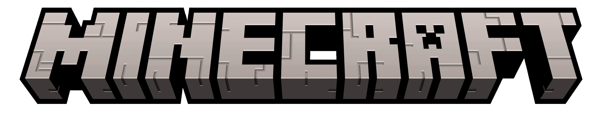

# Minecraft Server

Minecraft is an open-world sandbox game which is developed by Mojang Studios. Player can explore a procedurally generated world of basically infinite size based out of blocks and can discover hostile NPCs, build structures, craft tools and much more. 

Aside its single-player mode Minecraft also provides an extensive multiplayer experience via Minecraft servers and *Realms*, which is a server hosting service offered by Microsoft directly. Players can either buy a Realm subscription, rent a Minecraft Server through Third-Party providers or host the servers personally. 

!!! note
    Minecraft exists mainly in 2 different versions
    
    - *Java* is the original version since the game is developed in Java since its beginnings.
    - *Bedrock* is a smaller version of Minecraft intended for Mobile devices. It lacks a few features that the Java version has.

The base version of Minecraft which is released and provided directly by Mojang/Microsoft, also called *Vanilla*, does allow players to install mods. As for the client, the server also needs a so called mod loader. These mod loaders use Vanilla Minecraft and extend it to integrate mods. A few notable mod loaders are:

- [**Forge**](https://files.minecraftforge.net/net/minecraftforge/forge/)
- [**Fabric**](https://fabricmc.net/)
- [**NeoForge**](https://neoforged.net/)

## Minecraft Server Guides

Here you can find a few guides on how to set up your own Minecraft server from the start and configure it to your liking.

|Guide|Short Description|
|:----|:----------------|
|[**Minecraft Java Server Installation Guide for AlmaLinux 10 - with Mod support**](minecraft_server_install.md)| This is a step-by-step guide on how to install a Minecraft Java Server on AlmaLinux 10 with Mod support.|
|[**Minecraft Server Dashboard with VoxelDash**](voxel_dash_install.md)|This guide provides step-by-step instructions to install the mod VoxelDash which provides a dashboard for a Minecraft server|