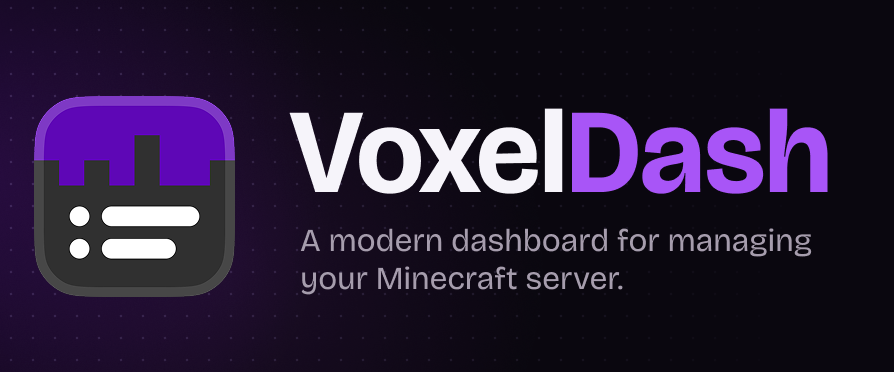

# VoxelDash on Minecraft Server - Forge Version

**VoxelDash** adds a modern dashboard to a Minecraft server. It provides an easy way to monitor the performance, player, backups and much more of your Minecraft server. For example, instead of logging into the command shell of the server which is hosting a Minecraft server, now there is an easy way to access the most common settings and even the Minecraft server command line itself.

## Requirements

Even though VoxelDash also supports the installation on a *Vanilla* Minecraft server, it is way easier to install it as a mod to a Forge Minecraft server. Therefore this is the preferred way, even when you don't want to use other modding capabilities of your server. Your Minecraft server should already have an `plugins` or `mods` directory in the server folder. If not, verify that you have a Mod loader setup like Forge, Fabric or NeoForge in use.

!!! tip
    If you don't have a Minecraft server with a mod loader setup you can refer to [this](minecraft_server_install.md) guide which will help you with the setup.

Besides the server itself, make sure the following requirements are also fulfilled:

- [x] Access to the shell of the host system
- [x] Write access to the Minecraft server directory
- [x] Access to the internet from the server


## VoxelDash Installation & Setup

The installation only consists of downloading the plugin from **Modrinth** where VoxelDash provides the `.jar` file that we need to copy to the `plugins` or `mods` directory within your Minecraft server directory.

1. First navigate to the [Modrinth VoxelDash page](https://modrinth.com/plugin/voxeldash). Click on the **Download** button at the top right of the page.
2. You'll be asked to either install the mod with the *Modrinth App* but you can also download it manually by selecting the game version and platform you are running your minecraft server on. In case of the Athenlyx Minecraft Server Installation Guide this would be **Forge**.
3. Once you selected the version, right-click on the **Download** button and copy the address of the download link. We will need it to paste it into the command shell on our Minecraft server.

Once you have the link, log into your Minecraft server using SSH. Once you're logged in navigate to your server directory and follow the commands below.

```console
[minecraft@minecraft server]$ ls
backups          banned-players.json  defaultconfigs  forge-26.2-65.0.3-installer.jar.log  logs  ops.json    run.bat  server-icon.png    user_jvm_args.txt   voxeldash-motd.json  world
banned-ips.json  config               eula.txt        forge-26.2-65.0.3-shim.jar           libraries   mods  README.txt  run.sh   server.properties  usercache.json  usernamecache.json  whitelist.json
[minecraft@minecraft mods]$ wget -O voxeldash_forge26-1.2.1.jar 'https://cdn.modrinth.com/data/PkDFalN3/versions/WSRKbWXh/voxeldash-forge26-1.2.1.jar?mr_download_reason=standalone&mr_game_version=26.2&mr_loader=forge'
--2026-08-11 16:29:10--  https://cdn.modrinth.com/data/PkDFalN3/versions/WSRKbWXh/voxeldash-forge26-1.2.1.jar?mr_download_reason=standalone&mr_game_version=26.2&mr_loader=forge
Resolving cdn.modrinth.com (cdn.modrinth.com)... 104.18.22.35, 104.18.23.35, 2606:4700::6812:1723, ...
Connecting to cdn.modrinth.com (cdn.modrinth.com)|104.18.22.35|:443... connected.
HTTP request sent, awaiting response... 200 OK
Length: 31336251 (30M) [application/java-archive]
Saving to: ‘voxeldash_forge26-1.2.1.jar’

voxeldash_forge26-1.2.1.jar                                             100%[=============================================================================================================================================================================>]  29.88M  65.2MB/s    in 0.5s

2026-08-11 16:29:11 (65.2 MB/s) - ‘voxeldash_forge26-1.2.1.jar’ saved [31336251/31336251]
```

This will download the mod file directly to the download folder. Now the Minecraft server needs to be restarted. With the next start the mod will be initialized and loaded. 
You can now access the dashboard through `http://<your-ip>:7867` or any DNS name that resolves to this system. 

To set the initial dashboard password log into your Minecraft server to access the Minecraft console with operator/server admin permissions. Once there type in the command `\voxeldash password <password>`.

Once the password is set you can access the dashboard log in and start managing your minecraft server without accessing the shell of your server directly. 

<!-- vale Vale.Terms = NO -->

!!! warning
    In this state the dashboard is only accessible with the unencrypted HTTP protocol. It is recommended to use a reverse proxy or WAF in between the anyone accessing VoxelDash since these tools can and should upgrade the communication to an encrypted HTTPS to enhance security or your password can be intercepted. It is also recommended to install nginx on the Minecraft server itself and to disable access to HTTP in anyway to the server.

<!-- vale Vale.Terms = YES -->

