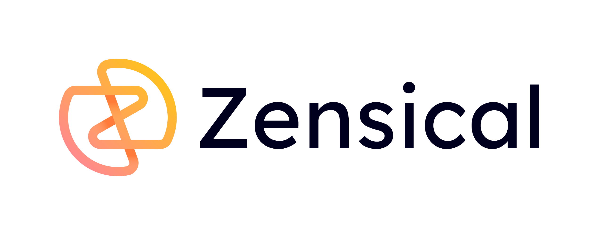

{ width=500 }

# Zensical - Material for Mkdocs successor

[Zensical](https://zensical.org/) is an open-source tool to create a fast and reliable website for technical documentations. It is developed by the same people who worked on [Material for mkdocs](../mkdocs/mkdocs_setup.md) which won't be getting new updates. Therefore Zensical is almost completely compatible with Material for Mkdocs, but comes with an easier setup and some Quality of Life features that are missing from Mkdocs. With the removal of the direct reliance on Mkdocs itself Zensical has none of its technical debt, which makes it faster and easier to use.

If you want to find out more about Zensical and how to set it up you can find step-by-step guide [here](zensical_setup.md).