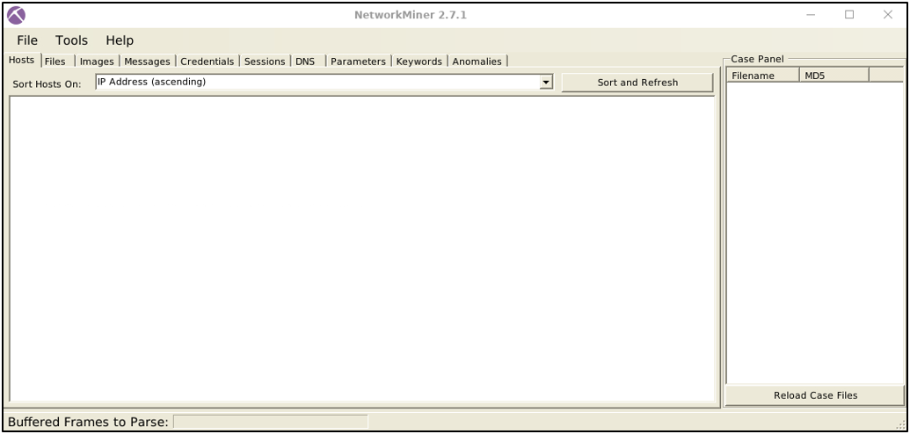
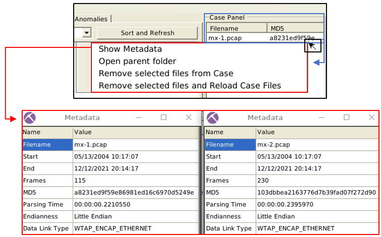
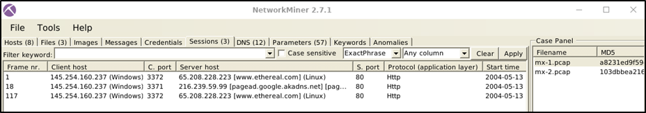

# NetworkMiner - Open Source Traffic Sniifer and more
>NetworkMiner is an open source Network Forensic Analysis Tool (NFAT) for Windows (but also works in Linux / Mac OS X / FreeBSD). NetworkMiner can be used as a passive network sniffer/packet capturing tool to detect operating systems, sessions, hostnames, open ports etc. without putting any traffic on the network. NetworkMiner can also parse PCAP files for off-line analysis and to regenerate/reassemble transmitted files and certificates from PCAP files.

NetworkMiner is a great tool to get:
- Context of captured hosts like their IP and MAC, hostnames, or OS information
- List of potential attack indicators or anomalies like traffic spikes or port scans
- Tools or toolkits used to perform the potential attacks like Nmap

It supports the following data types:
- Live Traffic
- Traffic Captures
- Log Files

## The Basics

NetworkMiner comes with to operating modes:
- **Sniffer Mode**: Although it has a sniffing feature, it is not intended to use as a sniffer. The sniffier feature is available only on Windows. However, the rest of the features are available in Windows and Linux OS. Based on this, it is not recommened as a sniffer.
- **Packet Parsing/Processing**: NetworkMiner can parse traffic captures to have a quick overview and information on the investigated capture. This operation mode is mainly suggested to grab the "low hanging fruit" before diving into a deeper investigation.
  
It is mainly used to gain an overview of the network since its capabilities are limited but its use is easy.

## The Program

You can see the list of the pcap files within the **Case Panel**.

The **hosts** menu shows the identified hosts in the pcap file.

The **Sessions** menu shows the detected sessions in the pcap file.

Another important menu is the **Credentials** menu, which shows extracted credentials and password hashes. You can use [Hashcat](https://github.com/hashcat/hashcat) and [John the Ripper](https://github.com/openwall/john) to decrypt the extracted credentials.

The **Files** menu shows extracted files from investigated pcaps.

The **Messages** menu shows extracted emails, chats and messages from investigated pcaps.

